# LLM package

`github.com/ktsoator/or/llm` provides one Go API for streaming responses,
structured tools, reasoning content, multimodal messages, and conversation
history across OpenAI-compatible and Anthropic-compatible models.

For a first pass through the package, read:

1. [Capabilities](capabilities.md) to map tasks to APIs;
2. [Getting started](getting-started.md) to run a first request;
3. [Developer guide](developer-guide.md) for architecture, lifecycle, boundaries, and troubleshooting;
4. [API reference](api-reference.md) for the public interface index;
5. [Support matrix](support-matrix.md) to verify protocol, provider, and model routing.

## What it is

The package is a **stateless translation layer**. For each request it decides
what to send on the wire and how to interpret the streamed response — nothing
more. The same provider-neutral conversation can be sent to any model on either
protocol, and the target model can change between turns; the library re-adapts
the history each time.

Everything above a single request — history storage, context compaction, and
the tool-call loop — is left to the caller. Two entry points cover the request
itself:

- `Complete` sends a conversation and returns the final `AssistantMessage`.
- `Stream` returns a channel of typed `Event` values for incremental rendering.

```mermaid
flowchart LR
    subgraph caller["Your code"]
        direction TB
        ctx["Context<br/><small>system · messages · tools</small>"]
        opts["StreamOptions<br/><small>key · temperature · reasoning</small>"]
        model["Model<br/><small>protocol · endpoint</small>"]
    end

    subgraph lib["llm · stateless translation"]
        direction TB
        entry(["Stream / Complete"])
        adapt["adapter for Model.Protocol<br/><small>re-adapt history → wire format</small>"]
        entry --> adapt
    end

    provider["Provider<br/><small>OpenAI- or Anthropic-compatible</small>"]

    subgraph back["Back to you"]
        direction TB
        events["typed Events<br/><small>text · thinking · tool-call deltas</small>"]
        final(["AssistantMessage<br/><small>content · stop reason · usage + cost</small>"])
        events --> final
    end

    caller --> entry
    adapt -->|request| provider
    provider -->|streamed response| events

    classDef accent stroke:#6366f1,stroke-width:2px;
    class entry,final accent;
```



## A first request

Resolve a model, send a prompt, read the reply. The blank import registers the
protocol; the API key is read from the provider's environment variable when
`StreamOptions` leaves it empty.

```go
import (
	"github.com/ktsoator/or/llm"
	_ "github.com/ktsoator/or/llm/openai" // register the OpenAI-compatible protocol
)

model := llm.GetModel("deepseek", "deepseek-v4-flash")

msg, err := llm.Complete(ctx, model,
	llm.Prompt("Explain Go channels briefly."),
	llm.StreamOptions{})
if err != nil {
	log.Fatal(err)
}

fmt.Println(msg.Text())                 // the answer
fmt.Println(msg.Usage.Cost.Total)       // what it cost
fmt.Println(msg.StopReason)             // why it stopped
```

To render output as it is generated, call `Stream` and consume the deltas:

```go
events, err := llm.Stream(ctx, model, llm.Prompt("Write a haiku about Go."), llm.StreamOptions{})
if err != nil {
	log.Fatal(err)
}
for event := range events {
	if event.Type == llm.EventTextDelta {
		fmt.Print(event.Delta)
	}
}
```

## Capabilities

- **Two protocols, one API** — OpenAI-compatible Chat Completions and
  Anthropic-compatible Messages behind the same types.
- **Streaming events** — text, reasoning, and tool-call deltas as typed events,
  each carrying a partial snapshot of the message so far.
- **Typed tools** — derive a JSON Schema from a Go struct and decode the model's
  call back into it, with best-effort recovery of malformed arguments.
- **Provider-neutral reasoning** — one effort level mapped to each provider's
  native thinking and clamped to what the model supports.
- **Multimodal input** — images alongside text, downgraded automatically for
  text-only models.
- **Usage and cost** — per-response token counts priced from the catalog,
  including cached tokens.
- **Model switching** — send one history to any model or protocol without
  rebuilding it; the library re-adapts it per request.
- **Persistence** — messages serialize to self-describing JSON and replay later
  against any model.
- **Extensible** — add a new wire protocol by implementing one adapter, without
  changing the shared request API.

| Task | Preferred API |
|---|---|
| Complete generation | `Complete`, `Prompt` |
| Streaming chat | `Stream`, `EventTextDelta` |
| Multi-turn history | `Context.Messages`, `UserText` |
| Image input | `UserImage`, `ImageContent` |
| Reasoning display | `StreamOptions.Reasoning`, thinking events |
| Tool calling | `MustTool`, `DecodeToolCall`, `ToolResult` |
| Model selection | `GetRunnableModels`, `SupportsProtocol` |
| Provider gateway | `ProviderRegistry.SetOverride` |
| Isolated client | `NewClient`, `NewAdapterRegistry` |
| New protocol | `ProtocolAdapter`, `StreamWriter` |

See [Capabilities](capabilities.md) for the complete mapping.

## Core objects

Five types carry almost everything you touch:

| Type | Role |
|---|---|
| `Model` | Which model to call — resolved from the catalog with `GetModel`, or built by hand to point at any compatible endpoint |
| `Context` | One request's input: system prompt, message history, and available tools |
| `Message` | A turn in the history — `UserMessage`, `AssistantMessage`, or `ToolResultMessage`, each holding typed content blocks |
| `StreamOptions` | Per-request settings: credentials, temperature, max tokens, reasoning effort, timeouts, and hooks |
| `AssistantMessage` | The result: content, stop reason, token usage with cost, and diagnostics |

## Common paths

Pick the guide for the task you have:

- **One request** — build a `Context` with `Prompt`, call `Complete`. See [Getting started](getting-started.md).
- **Multi-turn** — keep a growing `[]Message` and resend it each turn. See [Conversations](conversations.md).
- **Streaming** — call `Stream` and consume `Event` deltas as they arrive. See [Streaming](streaming.md).
- **Tools** — define typed tools and run the tool loop. See [Tools](tools.md).
- **Reasoning** — set an effort level and read thinking back. See [Reasoning](reasoning.md).
- **Switch models** — send the same history to a different model or protocol. See [Conversations § switch models](conversations.md#switch-models-between-turns).

## Scope boundary

`llm` does not execute tools, persist transcripts, compact context, or own a
multi-step run loop. Applications that use this package must implement those
responsibilities themselves or delegate them to a separate layer. This
documentation covers only `llm`.

## Install

```sh
go get github.com/ktsoator/or/llm@latest
```

## Documentation

- [Capabilities](capabilities.md) — what can be built and which APIs to call
- [Developer guide](developer-guide.md) — architecture, features, lifecycle, extension, and limits
- [Getting started](getting-started.md) — credentials and your first request
- [Protocol and provider support matrix](support-matrix.md) — implemented protocols, catalog models, and credentials
- [Providers and models](providers.md) — catalog discovery and custom endpoints
- [Streaming](streaming.md) — events, partial responses, diagnostics, and cancellation
- [Tools](tools.md) — typed tools, the tool loop, and protocol-specific tool choice
- [Reasoning](reasoning.md) — effort levels and thinking display
- [Reading responses](results.md) — stop reasons, usage and cost, and diagnostics
- [Error handling](errors.md) — error surfaces, missing keys, and validation
- [Conversations](conversations.md) — images, model switching, and persistence
- [Configuration](configuration.md) — retries, timeouts, headers, and HTTP hooks
- [Custom protocols](extending.md) — adapters, registries, and `StreamWriter`
- [Clients and registries](clients-and-registries.md) — explicit dependency injection, HTTP clients, and isolation
- [API reference](api-reference.md) — public interfaces organized by module
- [Task guides](recipes/README.md) — complete programs, call flows, parameters, failures, and operational constraints by scenario

Runnable programs for each topic are listed on the [Examples](examples.md) page.

For exported types and functions, see the package documentation on
[pkg.go.dev](https://pkg.go.dev/github.com/ktsoator/or/llm).

To understand how the package works internally, the
[Internals](../internals/overview.md) section is a source tour of the package:

- [Architecture overview](../internals/overview.md) — package layout, the registry/adapter/client triad, and request dispatch
- [Models and protocols](../internals/models.md) — the `Model`, its capabilities, decoding by protocol, and the catalog
- [Message types](../internals/messages.md) — the provider-neutral conversation model and its marker interfaces
- [Protocol adapters](../internals/adapters.md) — the adapter contract, registration, and building the SDK client
- [Streaming internals](../internals/streaming.md) — the `Event` union and the `StreamWriter` guarantees
- [Switching models](../internals/transform.md) — `TransformMessages` and overflow detection
