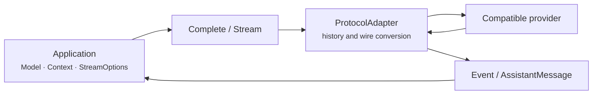

# LLM package

`github.com/ktsoator/or/llm` is a stateless LLM integration layer for Go applications. It lets applications construct requests and consume responses consistently—including messages, model selection, tool calls, reasoning output, and streaming—then connects model services through protocol adapters.

## Reading paths

| Current goal | Start here |
|---|---|
| Make a first model request | [Getting started](getting-started.md) |
| Map a feature to its API | [Capabilities](capabilities.md) |
| Implement a concrete application flow | [Task guides](recipes/README.md) |
| Understand module collaboration and lifecycle | [Developer guide](developer-guide.md) |
| Verify whether a protocol or model is runnable | [Protocol and provider status](support-matrix.md) |
| Find a public interface by name | [API reference](api-reference.md) |
| Run repository examples | [Examples index](examples.md) |

## Positioning

Each request consists of a `Model`, `Context`, and `StreamOptions`. `llm` selects an adapter from `Model.Protocol`, converts neutral messages into a provider request, and normalizes the returned stream into `Event` values and a final `AssistantMessage`.

There are two request entry points:

- `Complete` consumes the stream and returns the final `AssistantMessage`;
- `Stream` returns a typed event channel for incremental text, reasoning, and tool-call handling.

The first complete program, credential setup, and run command live in [Getting started](getting-started.md). A catalog entry alone does not make a model runnable; use `GetRunnableModels`, or check both `LookupModel` and `SupportsProtocol`.

## Responsibility boundary

`llm` owns per-request protocol conversion, stream normalization, tool-argument parsing, message transformation, usage, and catalog-priced cost calculation. It does not own:

- session storage or automatic history management;
- context trimming, summarization, or compaction;
- tool execution or tool authorization;
- an automatic multi-turn tool loop;
- agent planning, task scheduling, RAG, or vector retrieval;
- provider fallback, load balancing, or model racing.

The caller or a higher-level package must implement those responsibilities. Current protocol and provider status is maintained only in [Protocol and provider status](support-matrix.md).

## Reference documentation

- [Messages and context](conversations.md): message interfaces, content blocks, constructors, and serialization contracts.
- [Streaming events](streaming.md): event order, fields, termination, and cancellation.
- [Tool definitions and calls](tools.md): schemas, argument validation, and call-result contracts.
- [Reasoning options](reasoning.md): effort levels, thinking blocks, and protocol options.
- [Responses and usage](results.md): stop reasons, usage, cost, and diagnostics.
- [Models and providers](providers.md): discovery, compatible endpoints, and provider configuration.
- [Request options](configuration.md): credential precedence, retries, timeouts, and HTTP hooks.
- [Clients and registries](clients-and-registries.md): explicit dependency injection and state isolation.
- [Failure signals](errors.md) and [Troubleshooting](troubleshooting.md): failure contracts and symptom-based diagnosis.
- [Custom protocols](extending.md): `ProtocolAdapter`, protocol options, and `StreamWriter`.

Implementation details live in [Internals](../internals/overview.md). Exported symbols are also available on [pkg.go.dev](https://pkg.go.dev/github.com/ktsoator/or/llm).
