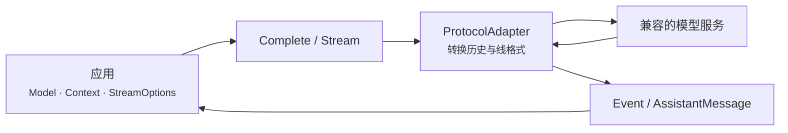

# LLM 包

`github.com/ktsoator/or/llm` 是面向 Go 应用的无状态 LLM 调用层。它让应用以一致的方式组织请求和读取响应，包括消息、模型选择、工具调用、推理内容与流式输出；再通过协议适配器连接不同的模型服务。

## 阅读路径

| 当前目标 | 从这里开始 |
|---|---|
| 第一次调用模型 | [快速开始](getting-started.md) |
| 查找功能对应的接口 | [功能总览](capabilities.md) |
| 完成一个具体应用场景 | [场景手册](recipes/README.md) |
| 理解模块协作和生命周期 | [开发者指南](developer-guide.md) |
| 确认协议或模型能否运行 | [协议与提供方状态](support-matrix.md) |
| 按名称查询公开接口 | [API 索引](api-reference.md) |
| 查看仓库中的可运行程序 | [示例索引](examples.md) |

## 定位

每次请求由 `Model`、`Context` 和 `StreamOptions` 组成。`llm` 根据 `Model.Protocol` 选择协议适配器，把统一消息转换成模型服务请求，再把响应流转换为 `Event` 和最终的 `AssistantMessage`。

请求入口只有两个：

- `Complete` 消费完整流并返回最终 `AssistantMessage`；
- `Stream` 返回类型化事件通道，用于增量处理文本、推理和工具调用。

第一个完整可运行程序、凭证配置和运行命令见[快速开始](getting-started.md)。不要只根据内置模型清单判断能否调用；运行时选择模型时使用 `GetRunnableModels`，或同时检查 `LookupModel` 与 `SupportsProtocol`。

## 职责边界

`llm` 负责单次请求的协议转换、流式事件统一、工具参数解析和消息转换。它还会统一模型服务返回的 Token 用量，并根据内置模型清单中的价格估算成本。它不负责：

- 保存会话或自动管理历史；
- 压缩、摘要或裁剪上下文；
- 执行工具或控制工具权限；
- 自动运行多轮工具循环；
- 智能体规划、任务调度、检索增强生成或向量检索；
- 提供方故障转移、负载均衡或多模型竞速。

这些职责由调用方或更上层模块实现。当前协议和提供方状态只在[协议与提供方状态](support-matrix.md)维护。

## 参考文档

- [消息与上下文](conversations.md)：消息接口、内容块、构造器和序列化契约。
- [流式事件](streaming.md)：事件顺序、字段、终止与取消。
- [工具定义与调用](tools.md)：JSON Schema、参数校验和调用结果契约。
- [推理配置](reasoning.md)：推理等级、思考内容块和协议选项。
- [响应与用量](results.md)：停止原因、Token 用量、成本估算和诊断。
- [模型与提供方](providers.md)：模型发现、兼容端点和提供方配置。
- [请求选项](configuration.md)：凭证优先级、重试、超时和 HTTP 回调。
- [`Client` 与注册表](clients-and-registries.md)：独立依赖配置和状态隔离。
- [失败信号](errors.md)与[问题排查](troubleshooting.md)：错误契约和按症状排查。
- [自定义协议](extending.md)：`ProtocolAdapter`、协议选项和 `StreamWriter`。

源码层面的实现说明位于[源码解析](../internals/overview.md)。完整导出符号也可在 [pkg.go.dev](https://pkg.go.dev/github.com/ktsoator/or/llm) 查询。
