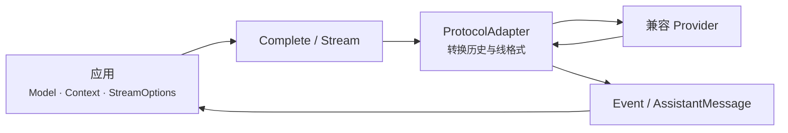

# LLM 包

`github.com/ktsoator/or/llm` 是面向 Go 应用的无状态 LLM 协议层。它用同一套消息、模型、工具、推理和流式事件类型调用 OpenAI Chat Completions 兼容端点与 Anthropic Messages 兼容端点。

## 阅读路径

| 当前目标 | 从这里开始 |
|---|---|
| 第一次调用模型 | [快速开始](getting-started.md) |
| 查找功能对应的接口 | [功能总览](capabilities.md) |
| 完成一个具体应用场景 | [场景手册](recipes/README.md) |
| 理解模块协作和生命周期 | [开发者指南](developer-guide.md) |
| 确认协议或模型能否运行 | [支持矩阵](support-matrix.md) |
| 按名称查询公开接口 | [API 索引](api-reference.md) |
| 查看仓库中的可运行程序 | [示例索引](examples.md) |

## 定位

每次请求由 `Model`、`Context` 和 `StreamOptions` 组成。`llm` 根据 `Model.Protocol` 选择 adapter，把中立消息转换成 provider 请求，再把返回流归一为 `Event` 和最终的 `AssistantMessage`。

请求入口只有两个：

- `Complete` 消费完整流并返回最终 `AssistantMessage`；
- `Stream` 返回类型化事件通道，用于增量处理文本、推理和工具调用。

第一个完整可运行程序、凭证配置和运行命令见[快速开始](getting-started.md)。不要只根据模型目录判断能否调用；运行时选择模型时使用 `GetRunnableModels`，或同时检查 `LookupModel` 与 `SupportsProtocol`。

## 职责边界

`llm` 负责单次请求的协议转换、流式归一化、工具参数解析、消息转换、usage 和目录成本计算。它不负责：

- 保存会话或自动管理历史；
- 压缩、摘要或裁剪上下文；
- 执行工具或控制工具权限；
- 自动运行多轮工具循环；
- Agent 规划、任务调度、RAG 或向量检索；
- provider fallback、负载均衡或多模型竞速。

这些职责由调用方或更上层模块实现。当前协议和 provider 状态只在[支持矩阵](support-matrix.md)维护。

## 专题文档

- [流式响应](streaming.md)：公开事件契约、部分消息、终止与取消。
- [工具](tools.md)：Schema、参数校验和工具循环协议。
- [推理与思考](reasoning.md)：中立推理等级和 provider 映射。
- [对话](conversations.md)：消息历史、图像、模型切换与序列化。
- [读取响应](results.md)：停止原因、usage、成本和诊断。
- [提供方与模型](providers.md)：模型发现、兼容端点和 provider 配置。
- [请求配置](configuration.md)：凭证优先级、重试、超时和 HTTP Hook。
- [Client 与注册表](clients-and-registries.md)：显式依赖注入和状态隔离。
- [错误处理](errors.md)与[排障](troubleshooting.md)：错误语义和按症状排查。
- [自定义协议](extending.md)：`ProtocolAdapter`、协议选项和 `StreamWriter`。

源码层面的实现说明位于[源码解析](../internals/overview.md)。完整导出符号也可在 [pkg.go.dev](https://pkg.go.dev/github.com/ktsoator/or/llm) 查询。
