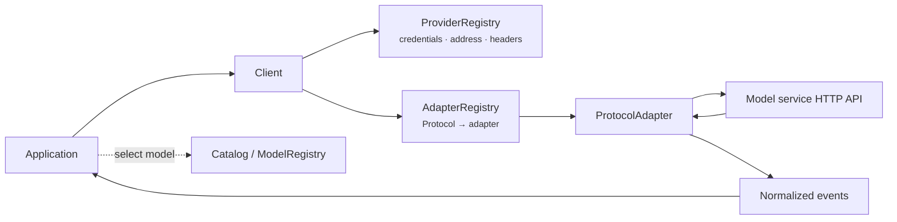
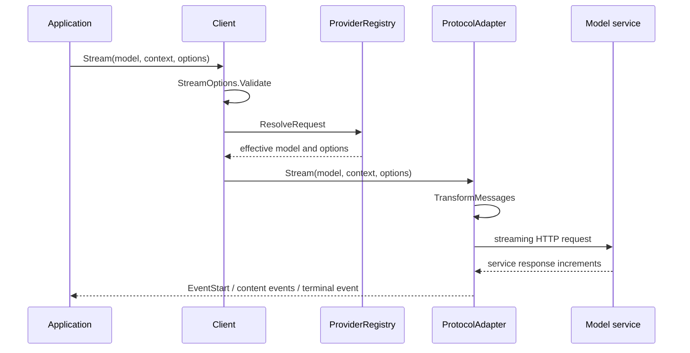

# or/llm developer guide

This page explains the module relationships, initialization choices, request
path, state boundaries, and extension routes of `or/llm`. It is intended for
developers integrating several model services, configuring an independent
client, diagnosing request execution, or implementing a protocol adapter.

For one concrete task, start from the [guides](recipes/README.md). Use the
[API reference](api-reference.md) to locate exported symbols and the pages under
API and concepts for field and behavioral contracts.

## Architectural role

Model services represent messages, tools, reasoning options, streamed output,
usage, and failures differently. `llm` uses its own `Context`, `Message`,
`Model`, `Event`, `ToolDefinition`, and `AssistantMessage` types for application
input and output, then delegates request and response conversion to a protocol
adapter.

The abstraction covers one model call:

- resolve the model, credentials, service address, and request options;
- transform history for the target model before sending;
- normalize service increments into common events;
- return content, stop reason, usage, estimated cost, and diagnostics.

Conversation databases, context compaction, tool execution, agent loops, RAG,
and provider scheduling are outside this layer.

## Main modules

| Module | Primary source | Responsibility |
|---|---|---|
| Messages and models | `llm/message.go`, `llm/model.go` | Messages, content blocks, model capability, usage, and stop reasons |
| Request entry | `llm/default.go`, `llm/client.go` | Validate options, resolve provider configuration, select an adapter |
| Adapter registration | `llm/adapters.go` | Map `Protocol` to `ProtocolAdapter` |
| Provider configuration | `llm/provider.go`, `llm/provider_registry.go` | Credentials, service address, headers, overrides, and auth status |
| Model catalog | `llm/catalog.go`, `llm/model_registry.go` | Built-in catalog and application model registries |
| History transformation | `llm/transform.go` | Image degradation, reasoning handling, and tool-call repair |
| Streaming events | `llm/events.go`, `llm/stream.go` | Common events, partial messages, and terminal guarantees |
| Tools | `llm/tools.go`, `llm/validation.go`, `llm/jsonschema.go` | Schema generation, recovery, validation, and decoding |
| Built-in adapters | `llm/openai/`, `llm/anthropic/` | Conversion for implemented request and response formats |

The modules relate as follows:



`ModelRegistry` supports model lookup and does not participate in client
dispatch. A request depends on the `Model` value, `ProviderRegistry`, and
`AdapterRegistry`. See [Clients and registries](clients-and-registries.md) for
the exact differences.

## Default or explicit client

Most applications use package-level `Complete` and `Stream`. Importing a
protocol package runs its `init` function and registers an adapter with the
default `AdapterRegistry`; the default `ProviderRegistry` is built from embedded
configuration.

```go
import (
	"github.com/ktsoator/or/llm"
	_ "github.com/ktsoator/or/llm/openai"
)
```

Use an explicit `Client` when:

- tenants or subsystems require independent provider overrides;
- a custom proxy, TLS configuration, pool, or transport is required;
- tests must not mutate process-wide default registries;
- only an allowlist of protocols may be used;
- a custom `ProtocolAdapter` must be registered.

See [Creating a custom client](recipes/custom-client.md) for the complete
program. A `Client` does not store conversations or create a model catalog for
each request.

## Request execution

One `Stream` call passes through the client, provider registry, and protocol
adapter:



`Complete` reuses the same streaming path, consumes events internally, and
returns an `AssistantMessage` after `EventDone` or `EventError`. Both entry
points therefore share history transformation, failure mapping, usage, and
diagnostics.

The event channel is unbuffered. A `Stream` caller must receive until close,
including after context cancellation or after the application stops displaying
increments. See [Streaming events](streaming.md) for ordering and termination.

## Configuration scope

| Scope | Type | Appropriate values |
|---|---|---|
| One request | `StreamOptions` | User credentials, sampling, output cap, timeout, headers, and hooks |
| One provider | `ProviderOverride` | Gateway address, shared credentials, common headers, and environment overrides |
| One client | `AdapterRegistry`, `ProviderRegistry` | Tenant isolation, protocol allowlists, and test state |
| One model | `Model`, `ModelCompatibility` | Service address, capabilities, context limits, and interface differences |

Precedence between request values and provider overrides is maintained only in
[Request options](configuration.md). Use `ProviderRegistry.ResolveRequest` when
diagnostics need the effective values passed to the adapter; do not reproduce
the merge logic in application code.

`OnRequest`, `RewriteRequest`, and `OnResponse` run for every SDK attempt. They
execute on the request path, so a blocking callback directly adds latency. See
[Recording and rewriting requests](recipes/observability.md).

## State, concurrency, and resources

- `Client` stores no session state. The application owns `Context.Messages` and
  decides when to persist them.
- Registry types support concurrent reads and mutations; the default provider
  registry is process-shared state.
- An in-flight request that already completed `ResolveRequest` is unaffected by
  later override changes.
- `Client` and registry types have no `Close` method.
- An adapter closes the response stream for one request; the application owns
  an injected `http.Client` and transport.
- Reuse HTTP clients and transports instead of rebuilding connection pools per
  request.
- Context controls the whole call; `StreamOptions.Timeout` controls one HTTP
  attempt.

See [Saving and restoring conversations](recipes/conversation-persistence.md)
for concurrent turn updates, storage versioning, and restore flow.

## Extension routes

First determine whether the target changes configuration or the request and
response format:

| Goal | Recommended extension point |
|---|---|
| Change an existing provider's service address or credentials | `ProviderOverride` |
| Connect one service compatible with an existing protocol | Construct a `Model` directly |
| Register a provider, credential variables, and a model set | `NewSpecProvider`, `ProviderRegistry.Register` |
| Change proxy, TLS, pool, or transport | Inject `*http.Client` into a built-in adapter |
| Observe requests or add a field not yet typed | `OnRequest`, `RewriteRequest`, `OnResponse` |
| Support a new request and response format | Implement `ProtocolAdapter` and required `ProtocolStreamOptions` |

`StreamWriter` helps a custom adapter preserve the shared event lifecycle. See
[Custom protocols](extending.md) for implementation requirements. Message and
content interfaces contain unexported marker methods, so external packages
cannot add roles or content blocks.

## Pre-production checklist

- Use `LookupModel` for configured or user-supplied model IDs so unknown input
  does not panic.
- Use `GetRunnableModels` or `SupportsProtocol` to confirm that the target
  adapter is registered in the current process.
- Use `AuthStatus` to check credential resolution, then make a real request to
  verify authorization.
- Set a context deadline for the whole call and define the boundary between SDK
  retries and application retries.
- Consume a stream until close. On client disconnect, cancel context and keep
  draining.
- Apply authorization, deadlines, idempotency keys, concurrency limits, and
  loop bounds to tool execution.
- Redact and control access to prompts, images, tool arguments, request bodies,
  history, and reasoning signatures.
- Record original `Usage` separately from estimated cost; `Usage.Cost` is not a
  model-service invoice.
- Verify authentication, streaming, tools, reasoning, usage, and failures
  against every production model service.

The package has no built-in log file, metrics exporter, billing reconciliation,
or official throughput benchmark.

## Troubleshooting entry points

| Symptom | Start here |
|---|---|
| Request returns an error before starting | [Failure signals](errors.md) |
| Stream does not close after cancellation | [Troubleshooting](troubleshooting.md#a-stream-never-closes-after-cancellation) |
| Model exists but cannot be called | [Finding models and checking credentials](recipes/provider-discovery.md) |
| Output is truncated or context overflows | [Handling request failures](recipes/error-handling.md) |
| Tool arguments are incomplete or invalid | [Tool definitions and calls](tools.md#validate-before-executing) |
| Custom service request is incompatible | [Connecting a custom model service](recipes/custom-gateway.md) |

See [Internals](../internals/overview.md) for source-level invariants and adapter
implementation details.
