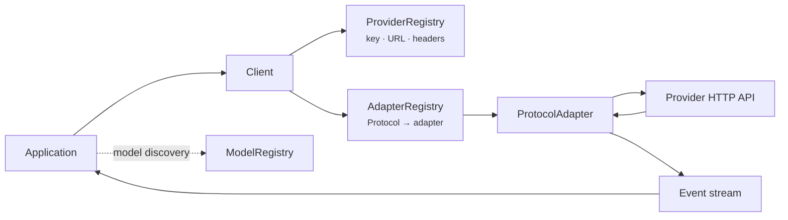
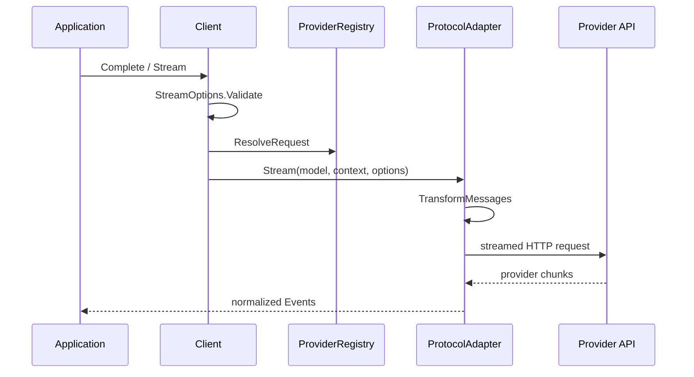

# or/llm developer guide

This guide explains the architecture, module collaboration, request lifecycle, extension boundaries, and runtime limits of `or/llm`. Complete feature programs live only in the corresponding topic guides and [task guides](recipes/README.md); exported signatures are indexed in the [API reference](api-reference.md).

## 1. Framework overview

### Problem addressed

LLM providers represent messages, tools, reasoning fields, streamed events, usage, and failures differently. `llm` carries application input and results in neutral domain types, then delegates wire conversion to protocol adapters.

Its core goals are to:

- send one `Context` to different models on implemented protocols;
- re-adapt stored history for the target model before every request;
- expose text, reasoning, and tool calls through one event lifecycle;
- keep tool definitions, validation, usage, and stop reasons independent of provider SDK types;
- let applications replace endpoints, credentials, HTTP transports, or an entire protocol adapter.

### Difference from an SDK wrapper

`llm` does not expose a union of two provider SDKs. `Message`, `Model`, `Context`, `Event`, `ToolDefinition`, and `AssistantMessage` form an independent domain model. Adapters own provider request construction, history transformation, stream normalization, compatibility dialects, and error mapping.

### Suitable uses

- Applications that own history storage and tool execution.
- Services that call multiple compatible providers.
- UIs that process text, thinking, and tool progress separately.
- Systems that need custom endpoints, proxies, headers, TLS, or connection pools.
- Applications that need an LLM request layer without a complete agent runtime.

### Unsuitable uses

Session storage, context compaction, automatic tool execution, agent planning, RAG, task scheduling, and provider load balancing are outside this package. Treat the [support matrix](support-matrix.md) as the source of truth for implemented protocols.

## 2. Architecture

### Core modules

| Module | Primary files | Responsibility |
|---|---|---|
| Domain model | `llm/message.go`, `llm/model.go` | Messages, content blocks, models, usage, and stop reasons |
| Request entry | `llm/default.go`, `llm/client.go` | Validation, provider resolution, and adapter dispatch |
| Adapter registration | `llm/adapters.go` | Mapping `Protocol` to `ProtocolAdapter` |
| Provider configuration | `llm/provider.go`, `llm/provider_registry.go` | Credentials, URLs, headers, overrides, and auth status |
| Model catalog | `llm/catalog.go`, `llm/model_registry.go` | Embedded catalog and application model registries |
| History transformation | `llm/transform.go` | Image downgrade, reasoning cleanup, and tool-call repair |
| Streaming runtime | `llm/events.go`, `llm/stream.go` | Normalized events and terminal-event guarantees |
| Tools | `llm/tools.go`, `llm/validation.go`, `llm/jsonschema.go` | Schema generation, recovery, validation, and decoding |
| Built-in adapters | `llm/openai/`, `llm/anthropic/` | Request and response conversion for implemented protocols |

### Registries, client, and adapter

- `AdapterRegistry` decides which implementation handles `Model.Protocol`.
- `ProviderRegistry` resolves credentials, URLs, and headers for that model request.
- `ModelRegistry` is for discovery only; `Client` does not depend on it to send requests.
- Package-level `Complete` and `Stream` use a default `Client`. Explicit clients provide state isolation and dependency injection.

### Initialization

1. `llm/default.go` constructs the default adapter registry, provider registry, and client.
2. The application imports `llm/openai`, `llm/anthropic`, or `llm/all`.
3. Adapter package `init` functions register protocol implementations in the default adapter registry.
4. The model catalog is decoded during package initialization; built-in provider configuration populates the provider registry.
5. The application resolves or constructs a `Model` and calls a request entry point.

The package starts no server, plugin scanner, or background scheduler.

## 3. Core capabilities

This section assigns responsibilities only. See [Capabilities](capabilities.md) for the complete task-to-API mapping.

| Capability | `llm` owns | Caller owns | Canonical guide |
|---|---|---|---|
| Complete generation | Collect events into `AssistantMessage` | Result handling and business policy | [Getting started](getting-started.md) |
| Streaming | Normalize events, partial snapshots, and termination | Consume the channel and update the UI | [Streaming](streaming.md) |
| Conversations | Transform provider-neutral history | Store, load, append, and compact history | [Conversations](conversations.md) |
| Image input | Convert base64 images and downgrade for text models | File loading, size limits, and MIME validation | [Image-input task guide](recipes/vision.md) |
| Reasoning | Map neutral effort and separate thinking content | Effort selection and display policy | [Reasoning](reasoning.md) |
| Tool calls | Schema, argument recovery, validation, and result types | Authorization, execution, idempotency, and loop limits | [Tools](tools.md) |
| Models and providers | Catalog queries, credential resolution, and overrides | Model selection and live compatibility verification | [Providers and models](providers.md) |
| Observability | Request, rewrite, and response hooks | Redaction, metrics, and logging backends | [Configuration](configuration.md) |

Complete application flows are in the [task guides](recipes/README.md); repository programs are in the [examples index](examples.md).

## 4. Configuration

The authoritative option table and credential precedence are in [Configuration](configuration.md). The scopes are:

| Scope | Type | Lifetime | Typical use |
|---|---|---|---|
| One request | `StreamOptions` | One `Complete` or `Stream` call | Key, sampling, output limit, timeout, hooks |
| One provider | `ProviderOverride` | Subsequent requests through the registry | Gateway URL, shared headers, provider key |
| One client | `AdapterRegistry`, `ProviderRegistry` | Owned by the application | Tenant or subsystem isolation |
| One model | `Model`, `Compatibility` | Copied with the model value | Endpoint, capabilities, protocol dialect |

Do not duplicate request/override precedence in application code. Use `ProviderRegistry.ResolveRequest` when diagnostics need the model and options that the adapter will receive.

## 5. Quick start

The shortest runnable path is maintained only in [Getting started](getting-started.md):

1. Add the module with Go 1.24 or later.
2. Configure the selected provider credential.
3. Import the adapter for the model protocol.
4. Validate the model with `LookupModel` and `SupportsProtocol`.
5. Call `Complete` and handle its error.

Task-guide programs add complete result handling and production constraints to that base.

## 6. Lifecycle and execution

### One request

`Complete` reuses `Stream` and returns after `EventDone` or `EventError`. The adapter goroutine closes the SDK stream and event channel on exit. See [Streaming](streaming.md) for the consumer contract.

### Hooks and retries

`OnRequest`, `RewriteRequest`, and `OnResponse` run for every SDK attempt. `RewriteRequest` starts from the original serialized body on each attempt. There is no additional cross-SDK guarantee for middleware nesting order; do not depend on an undocumented order.

### Resource release

- `Client` and registry types have no `Close` method.
- The adapter closes the provider stream for each request.
- The application owns and reuses an injected `http.Client` and Transport.
- Context cancellation controls the whole request; `StreamOptions.Timeout` limits one HTTP attempt.
- A stream consumer must read the event channel until it closes.

## 7. Extension mechanisms

| Requirement | Extension point | Notes |
|---|---|---|
| New endpoint using an existing wire protocol | Construct `Model` | Set `Protocol`, `BaseURL`, and required compatibility flags |
| New provider configuration | `NewSpecProvider`, `ProviderRegistry.Register` | Declare credential variables, headers, and models |
| Custom proxy, TLS, or Transport | `openai.NewAdapter`, `anthropic.NewAdapter` | Inject an application-owned `*http.Client` |
| Request observation or field patch | `OnRequest`, `RewriteRequest`, `OnResponse` | Hooks run synchronously in the request goroutine |
| New wire protocol | `ProtocolAdapter`, `ProtocolStreamOptions` | Use `StreamWriter` to preserve the public event contract |

See [Custom protocols](extending.md) for implementation requirements. Message and content interfaces contain unexported marker methods, so external packages cannot add roles or content blocks; audio, documents, citations, and similar types require a core package change.

## 8. Error handling and diagnosis

| Stage | Signal | Investigation entry |
|---|---|---|
| Before request creation | `Complete`/`Stream` returns an error directly | Options, credentials, adapter registration |
| During the stream | `EventError`; `Complete` returns a partial message and error | HTTP, provider, decoding, cancellation |
| Normal termination requiring policy | `AssistantMessage.StopReason` | Token limit, tool request, and similar outcomes |
| Recovered non-fatal issue | `AssistantMessage.Diagnostics` | Tool-argument recovery and related diagnostics |

See [Error handling](errors.md) for semantics, [Troubleshooting](troubleshooting.md) for symptom-based fixes, and the [error-handling task guide](recipes/error-handling.md) for a reusable application policy. The package has no built-in log file or global logger.

## 9. Limits

- The [support matrix](support-matrix.md) is the sole source for implemented and catalog-only protocols and provider status.
- All three registry types support concurrent access; the default provider registry is process-shared state.
- The event channel is unbuffered, so a consumer that stops reading blocks the producer.
- Every non-terminal event carries a `Partial` snapshot; high-frequency processing increases allocation.
- Base64 images increase memory use and request size.
- Tool validation covers a practical JSON Schema subset, not the complete specification.
- The model catalog is embedded at build time; prices, capabilities, and status can lag the provider.
- Hooks, serialized history, tool results, and reasoning signatures can contain sensitive data.
- The current material defines no official throughput benchmark, built-in metrics exporter, or billing reconciliation.

## 10. API and module index

The [API reference](api-reference.md) organizes public interfaces by requests, messages, events, options, tools, models, providers, diagnostics, and extensions. Topic entry points are:

| Module | Documentation |
|---|---|
| Requests and options | [Getting started](getting-started.md), [Configuration](configuration.md) |
| Messages and results | [Conversations](conversations.md), [Reading responses](results.md) |
| Streaming | [Streaming](streaming.md) |
| Tools and reasoning | [Tools](tools.md), [Reasoning](reasoning.md) |
| Models and providers | [Providers and models](providers.md), [Support matrix](support-matrix.md) |
| Clients and registries | [Clients and registries](clients-and-registries.md) |
| Errors and diagnosis | [Error handling](errors.md), [Troubleshooting](troubleshooting.md) |
| Testing and extension | [Testing](testing.md), [Custom protocols](extending.md) |

See [Internals](../internals/overview.md) for implementation details and source-level invariants.
