# or/llm

`or/llm` is the LLM protocol layer in `github.com/ktsoator/or`. It gives Go applications one message, model, tool, reasoning, and streaming-event API for OpenAI Chat Completions-compatible and Anthropic Messages-compatible endpoints. Typical uses are chat backends, streaming UIs, structured tool calling, multi-model routing, and private model gateways.

## 1. Framework overview

### Problem addressed

LLM providers differ in request fields, message formats, reasoning content, tool calls, streamed events, usage, and errors. `llm` maps those differences into one Go domain model and translates each request and response at runtime.

Its implemented goals are:

- send one `Context` through either implemented protocol;
- adapt stored history when the target model changes;
- expose text, reasoning, and tool calls as typed stream events;
- define and validate tools independently of a provider;
- preserve provider-issued reasoning and tool-call signatures when required;
- expose model capability, limits, and catalog pricing to the caller.

### Difference from a thin SDK wrapper

`llm` defines provider-neutral `Message`, `Context`, `Model`, `Event`, and `ToolDefinition` types. Adapters also perform history transformation, compatibility-dialect handling, stream normalization, tool-argument recovery, usage normalization, cost calculation, and stop-reason mapping.

### Suitable uses

- the application owns message history and tool execution;
- one service calls multiple compatible providers;
- a UI renders text, thinking, and tool progress separately;
- requests need a custom endpoint, proxy, headers, or HTTP transport;
- tools are needed without an agent runtime.

### Unsuitable uses

- automatic session storage, context compaction, or tool-loop execution is required;
- the application needs RAG, vector search, scheduling, or agent planning;
- the endpoint only supports OpenAI Responses, Google Generative AI, or Mistral Conversations;
- custom audio, document, or message-block types are required. Content interfaces are sealed.

## 2. Architecture

### Core modules

| Module | Files | Responsibility |
|---|---|---|
| Domain model | `llm/message.go`, `llm/model.go` | Messages, blocks, models, usage, stop reasons |
| Request entry | `llm/default.go`, `llm/client.go` | Validation, provider resolution, adapter dispatch |
| Adapter registry | `llm/adapters.go` | Concurrent `Protocol` to `ProtocolAdapter` mapping |
| Provider configuration | `llm/provider.go`, `llm/provider_registry.go` | Keys, URLs, headers, overrides, auth status |
| Model catalog | `llm/catalog.go`, `llm/model_registry.go` | Embedded catalog and model lookup |
| History transformation | `llm/transform.go` | Image downgrade, reasoning cleanup, tool repair |
| Streaming runtime | `llm/events.go`, `llm/stream.go` | Normalized events and one terminal event |
| Tools | `llm/tools.go`, `llm/validation.go`, `llm/jsonschema.go` | Schema generation, recovery, validation, decoding |
| OpenAI adapter | `llm/openai/` | Chat Completions requests and SSE responses |
| Anthropic adapter | `llm/anthropic/` | Messages requests and block-stream conversion |

### Collaboration

```mermaid
flowchart LR
    app["Application"] --> entry["Complete / Stream"]
    entry --> validate["StreamOptions.Validate"]
    validate --> providers["ProviderRegistry.ResolveRequest"]
    providers --> registry["AdapterRegistry.Get(Model.Protocol)"]
    registry --> adapter["ProtocolAdapter.Stream"]
    adapter --> transform["TransformMessages"]
    transform --> sdk["Provider SDK / HTTP / SSE"]
    sdk --> writer["StreamWriter"]
    writer --> events["Event stream"]
    events --> app
```



### Initialization

1. `llm/default.go` creates the default adapter registry, provider registry, and client.
2. The application side-effect imports `llm/openai`, `llm/anthropic`, or `llm/all`.
3. Adapter package `init` functions call `llm.Register`.
4. The application resolves or constructs a `Model`.
5. `Complete` or `Stream` selects an adapter from `Model.Protocol`.

There is no server bootstrap, plugin scan, or background scheduler.

### Request data flow

1. `Client.Stream` calls `StreamOptions.Validate`.
2. `ProviderRegistry.ResolveRequest` applies key, URL, and header precedence.
3. `AdapterRegistry.Get` selects a protocol adapter.
4. The adapter calls `TransformMessages`.
5. The adapter creates the SDK client and protocol request.
6. The SDK opens a streaming HTTP request.
7. The adapter accumulates chunks into `AssistantMessage`.
8. `StreamWriter` emits block events and one terminal event.
9. `Complete` consumes the stream through `EventDone` or `EventError`.

## 3. Core features

### 3.1 Complete model calls

**Purpose**

`Complete` sends one request, consumes the provider stream, and returns the final `AssistantMessage`.

**Use cases**

- HTTP handlers that only need final text;
- batch jobs;
- one turn of an application-owned tool loop.

**Mechanism**

`Client.Complete` calls `Client.Stream`. It returns the message from `EventDone`, or the partial message and error from `EventError`.

**Primary API**

```go
func Complete(context.Context, Model, Context, StreamOptions) (AssistantMessage, error)
```

**Example**

```go
package main

import (
	"context"
	"fmt"
	"log"

	"github.com/ktsoator/or/llm"
	_ "github.com/ktsoator/or/llm/openai"
)

func main() {
	model, ok := llm.LookupModel("deepseek", "deepseek-v4-flash")
	if !ok {
		log.Fatal("model not found")
	}
	response, err := llm.Complete(context.Background(), model,
		llm.Prompt("Reply with one sentence."), llm.StreamOptions{})
	if err != nil {
		log.Fatal(err)
	}
	fmt.Println(response.Text())
}
```

**Limits and failure behavior**

- The model protocol adapter must be registered.
- A key must resolve from options, provider override, or environment.
- `Complete` still uses the provider's streaming API internally.
- A non-nil error can accompany partial content and usage.

### 3.2 Streaming responses

**Purpose**

`Stream` exposes text, thinking, and tool arguments through `<-chan Event`.

**Use cases**

- chat UIs;
- time-to-first-token-sensitive endpoints;
- separate reasoning or tool-progress rendering.

**Mechanism**

An adapter goroutine reads the SDK stream. `StreamWriter` emits `EventStart`, block start/delta/end events, and one `EventDone` or `EventError`.

**Primary API**

```go
func Stream(context.Context, Model, Context, StreamOptions) (<-chan Event, error)
```

**Example**

```go
events, err := llm.Stream(ctx, model, llm.Prompt("Write a haiku."), llm.StreamOptions{})
if err != nil {
	log.Fatal(err)
}
for event := range events {
	switch event.Type {
	case llm.EventTextDelta:
		fmt.Print(event.Delta)
	case llm.EventDone:
		fmt.Printf("\ntokens=%d\n", event.Message.Usage.TotalTokens)
	case llm.EventError:
		log.Printf("stream failed: %v", event.Err)
	}
}
```

**Limits and failure behavior**

- The event channel is unbuffered. Continue receiving until it closes.
- If deltas are no longer needed, drain the channel before abandoning the request.
- Execute tools only after `EventDone`.
- Every non-terminal event includes a `Partial` snapshot, which adds allocation cost.
- Cancellation becomes `StopReasonAborted` when the adapter goroutine can emit its terminal event.

### 3.3 Conversations, persistence, and model switching

**Purpose**

`Context.Messages` stores provider-neutral history owned by the caller.

**Use cases**

- multi-turn chat;
- database persistence;
- changing model or protocol between turns.

**Mechanism**

Before each request, `TransformMessages` downgrades unsupported images, preserves reasoning only for the exact source model, removes cross-model signatures, normalizes tool IDs, drops failed partial turns, and repairs unanswered tool calls.

**Primary API**

`Context`, `Message`, `UserText`, `AssistantText`, `ToolResult`, `MarshalMessage`, `UnmarshalMessage`, and `TransformMessages`.

**Example**

```go
messages := []llm.Message{llm.UserText("Name a Go router.")}
reply, err := llm.Complete(ctx, model,
	llm.Context{Messages: messages}, llm.StreamOptions{})
if err != nil {
	log.Fatal(err)
}
messages = append(messages, &reply, llm.UserText("Show a minimal route."))
reply, err = llm.Complete(ctx, anotherModel,
	llm.Context{Messages: messages}, llm.StreamOptions{})
```

**Limits and failure behavior**

- The caller stores history; the package has no session store.
- `SystemPrompt` is request state and is not inserted into history.
- Persisted history can contain user data, tool results, and provider signatures.
- Tool results must follow the assistant call they answer.

### 3.4 Image input

**Purpose**

`ImageContent` carries base64 image data in user messages or tool results.

**Use cases**

- screenshot analysis;
- visual question answering;
- returning an image from a tool.

**Mechanism**

Adapters translate image blocks into protocol-native forms. `TransformMessages` replaces images with text placeholders when `Model.Input` does not contain `Image`.

**Primary API**

`UserImage`, `ImageContent`, `Model.Input`, `ModelInput`, and `Image`.

**Example**

```go
raw, err := os.ReadFile("screenshot.png")
if err != nil {
	log.Fatal(err)
}
input := llm.Context{Messages: []llm.Message{
	&llm.UserMessage{Content: []llm.UserContent{
		&llm.TextContent{Text: "Describe this screenshot."},
		&llm.ImageContent{
			Data: base64.StdEncoding.EncodeToString(raw), MIMEType: "image/png",
		},
	}},
}}
```

**Limits and failure behavior**

- The model contains base64 data, not image URLs.
- Assistant messages cannot contain images.
- Missing MIME type or data is an adapter error.
- Text-only models receive a placeholder rather than image content.

### 3.5 Reasoning content

**Purpose**

`StreamOptions.Reasoning` requests a provider-neutral effort level. Thinking is returned separately from answer text.

**Use cases**

- select effort for complex tasks;
- render thinking separately;
- preserve signatures needed by multi-turn tool use.

**Mechanism**

Adapters clamp and map the requested level. Anthropic can return summarized or omitted thinking. Cross-model replay removes reasoning.

**Primary API**

`ModelThinkingLevel`, `SupportedThinkingLevels`, `ClampThinkingLevel`, `ThinkingContent`, thinking events, and `AnthropicStreamOptions.ThinkingDisplay`.

**Example**

```go
events, err := llm.Stream(ctx, model, input,
	llm.StreamOptions{Reasoning: llm.ModelThinkingHigh})
if err != nil {
	log.Fatal(err)
}
for event := range events {
	if event.Type == llm.EventThinkingDelta {
		fmt.Fprint(reasoningWriter, event.Delta)
	}
}
```

**Limits and failure behavior**

- Non-reasoning models ignore the setting.
- Thinking tokens count as output usage.
- `ThinkingDisplayOmitted` hides returned text; it does not disable reasoning.
- Built-in history transformation only replays signatures to the exact source model.

### 3.6 Tool calling

**Purpose**

The tool API derives JSON Schema from Go structs and validates model calls. The application executes the tool.

**Use cases**

- business-data lookup;
- external API calls;
- schema-constrained action parameters.

**Mechanism**

Define a tool, include it in `Context.Tools`, decode returned calls, execute application code, append `ToolResultMessage`, and call the model again.

**Primary API**

`NewTool`, `MustTool`, `DecodeToolCall`, `ValidateToolCall`, `ValidateToolArguments`, `ToolResult`, and protocol-specific tool choice.

**Example**

```go
type WeatherArgs struct {
	City string `json:"city" jsonschema:"minLength=1"`
}
tool := llm.MustTool[WeatherArgs]("get_weather", "Get current weather")
response, err := llm.Complete(ctx, model, llm.Context{
	Messages: []llm.Message{llm.UserText("Weather in Paris?")},
	Tools:    []llm.ToolDefinition{tool},
}, llm.StreamOptions{})
if err != nil {
	log.Fatal(err)
}
for _, call := range response.ToolCalls() {
	args, err := llm.DecodeToolCall[WeatherArgs](tool, call)
	if err != nil {
		log.Print(err)
		continue
	}
	fmt.Println(args.City)
}
```

**Limits and failure behavior**

- Do not execute calls observed before `EventDone`.
- Every tool call requires one result.
- Recovered arguments are reported in `Diagnostics`; validate before side effects.
- The validator implements the tool-oriented schema subset, not the full JSON Schema specification.
- Application loops need a turn limit.

### 3.7 Model and provider management

**Purpose**

The model catalog supports discovery. The provider registry resolves credentials and request overrides.

**Use cases**

- model selection UIs;
- credential-status checks;
- provider proxying;
- local or private endpoints.

**Mechanism**

`ModelRegistry` stores model metadata by provider and ID. `ProviderRegistry` stores credential sources and overrides. `Client` receives a concrete `Model`; it does not query an application `ModelRegistry` automatically.

**Primary API**

`LookupModel`, `GetRunnableModels`, `SupportsProtocol`, `DefaultProviderRegistry`, `AuthStatus`, `SetOverride`, `ClearOverride`, `NewSpecProvider`, `NewModelRegistry`, and `NewProviderRegistry`.

**Example**

```go
registry := llm.DefaultProviderRegistry()
status, ok := registry.AuthStatus("deepseek", nil)
if ok && !status.Configured {
	log.Fatalf("missing one of %v", status.Missing)
}
proxy := "https://gateway.example.com/deepseek/v1"
registry.SetOverride("deepseek", llm.ProviderOverride{BaseURL: &proxy})
defer registry.ClearOverride("deepseek")
```

**Limits and failure behavior**

- `GetModels` includes catalog models with unimplemented protocols.
- Build runnable lists from `GetRunnableModels`.
- Official OpenAI catalog models currently use unimplemented `openai-responses`.
- Overrides are process state; use independent clients for tenant-specific URLs.

### 3.8 Observability and request rewriting

**Purpose**

`StreamOptions` provides per-attempt request and response callbacks plus serialized JSON rewriting.

**Use cases**

- tracing and audit;
- observing SDK retries;
- adding a provider field not represented by typed options.

**Mechanism**

Adapters install SDK middleware. `OnRequest` observes a serialized body, `RewriteRequest` may replace it, and `OnResponse` observes status and headers before body consumption. Retries rerun the callbacks.

**Primary API**

`OnRequest`, `RewriteRequest`, `OnResponse`, `MaxRetries`, and `Timeout`.

**Example**

```go
options := llm.StreamOptions{
	OnRequest: func(method, url string, body []byte) {
		log.Printf("%s %s bytes=%d", method, url, len(body))
	},
	OnResponse: func(status int, headers http.Header) {
		log.Printf("status=%d", status)
	},
}
```

**Limits and failure behavior**

- Callbacks can access prompts, tool arguments, and metadata; redact logs.
- `RewriteRequest` can produce invalid JSON and is not type-validated again.
- Callbacks execute in the provider-stream goroutine; blocking increases latency.
- Current material defines no built-in metrics exporter or logging backend.

## 4. Configuration

### StreamOptions

| Setting | Type | Default | Required | Purpose | Constraints |
|---|---|---|---|---|---|
| `APIKey` | `string` | `""` | No | Per-request credential | Empty falls through to override and environment |
| `Env` | `ProviderEnv` | nil | No | Request-scoped environment | Does not mutate process environment |
| `Temperature` | `*float64` | nil | No | Sampling temperature | May be omitted when Anthropic thinking is active |
| `MaxTokens` | `int64` | 0 | No | Output limit | Anthropic falls back to `Model.MaxTokens`; both zero is an error |
| `Headers` | `map[string]string` | nil | No | Request headers | Override same-name model/provider values |
| `Reasoning` | `ModelThinkingLevel` | `""` | No | Reasoning effort | Clamped to model support |
| `ProtocolOptions` | `ProtocolStreamOptions` | nil | No | Protocol-native settings | Must match `Model.Protocol` |
| `MaxRetries` | `*int` | nil | No | SDK retry count | `0` disables SDK retries |
| `Timeout` | `time.Duration` | 0 | No | Per-attempt timeout | Context still controls the full request |
| `OnRequest` | callback | nil | No | Observe every attempt | Can expose sensitive request bodies |
| `RewriteRequest` | callback | nil | No | Replace request JSON | nil return preserves the body |
| `OnResponse` | callback | nil | No | Observe status and headers | Called for each retry response |

### ProviderOverride

| Setting | Type | Default | Required | Purpose | Constraints |
|---|---|---|---|---|---|
| `BaseURL` | `*string` | nil | No | Replace provider model URLs | Affects later requests through that registry |
| `APIKey` | `*string` | nil | No | Provider-level credential | Request `APIKey` wins |
| `Headers` | `map[string]string` | nil | No | Provider headers | Request headers win |
| `Env` | `ProviderEnv` | nil | No | Provider environment overrides | Request `Env` wins |

Credential precedence is request `APIKey`, override `APIKey`, request `Env`, override `Env`, then process environment.

## 5. Quick start

The project requires Go 1.24 or later.

```sh
go get github.com/ktsoator/or/llm@latest
export DEEPSEEK_API_KEY=your-key
```

```go
package main

import (
	"context"
	"fmt"
	"log"

	"github.com/ktsoator/or/llm"
	_ "github.com/ktsoator/or/llm/openai"
)

func main() {
	model, ok := llm.LookupModel("deepseek", "deepseek-v4-flash")
	if !ok || !llm.SupportsProtocol(model.Protocol) {
		log.Fatal("model is not runnable")
	}
	response, err := llm.Complete(context.Background(), model,
		llm.PromptWithSystem("Be concise.", "What is a goroutine?"),
		llm.StreamOptions{MaxTokens: 256})
	if err != nil {
		log.Fatal(err)
	}
	fmt.Println(response.Text())
	fmt.Printf("tokens=%d cost=$%.6f\n",
		response.Usage.TotalTokens, response.Usage.Cost.Total)
}
```

Run with `go run .`. The generated text depends on the provider and is not a fixed value.

## 6. Lifecycle and execution

### Initialization

- Loading `llm` creates the default registries and client.
- Side-effect imports execute adapter registration.
- The embedded catalog JSON is decoded into the built-in `ModelRegistry`.
- The built-in provider registry derives configuration from the catalog and `llm/keys.go`.

### Request execution

```text
validate options
  → resolve provider configuration
  → select adapter
  → transform history
  → build SDK client and request
  → open HTTP stream
  → decode provider events
  → emit normalized events
  → done or error
```

### Middleware order

Adapters add base client options, OpenAI SSE compatibility middleware, `OnRequest`, `RewriteRequest`, `OnResponse`, and headers. Final middleware nesting is controlled by each SDK; current material does not define a stricter cross-SDK ordering guarantee beyond callback behavior.

Retries rerun request and response callbacks. `RewriteRequest` starts from the original serialized body on each attempt.

### Termination and resources

- The adapter goroutine owns and closes the SDK stream.
- It emits one terminal event, then closes the event channel.
- `Client`, registries, and adapters have no `Close` method.
- Context cancels the whole request; `Timeout` limits each HTTP attempt.
- The caller must receive until the event channel closes to avoid blocking the adapter.

## 7. Extension mechanisms

### Compatible endpoint

Construct a `Model` with an existing `Protocol` and custom `BaseURL`. Do not create one adapter per compatible provider.

### Provider

Use `NewSpecProvider` to declare ID, name, environment keys, models, and headers. `ProviderSpec` does not implement OAuth refresh or dynamic multi-field authentication; current source describes that as a later extension.

### Request hooks

Use `OnRequest`, `OnResponse`, and `RewriteRequest` for per-request observation or rewriting. They are not a global plugin system.

### Explicit dependency injection

`NewClient` accepts adapter and provider registries. `openai.NewAdapter` and `anthropic.NewAdapter` accept `*http.Client`. These are the dependency-injection boundaries in current code.

### Custom protocol

Implement `ProtocolAdapter` and use `StreamWriter` for the normalized event lifecycle. Custom protocol options implement `ProtocolStreamOptions`.

### Closed extension points

Message and content interfaces contain unexported marker methods. External packages cannot add roles or content blocks. Audio, document, citation, or other blocks require a core-package change; current code has no public extension point for them.

## 8. Error handling and troubleshooting

| Symptom | Likely cause | Check | Action |
|---|---|---|---|
| `no adapter registered` | Missing import or unimplemented protocol | `model.Protocol`, `SupportsProtocol` | Import `llm/openai`/`llm/anthropic`; imports cannot fix catalog-only protocols |
| `GetModel` panic | Unknown provider/model ID | `GetProviders`, `GetModels` | Use `LookupModel` for dynamic input |
| Empty API key | Missing environment, override, or request key | `APIKeyEnvVars`, `AuthStatus` | Configure a key or pass `StreamOptions.APIKey` |
| Setup returns an error | Mismatched options, invalid tool, empty model ID | Error text, `StreamOptions.Validate` | Correct local configuration |
| Stream ends with `EventError` | HTTP, SDK, provider, or decoding failure | `Event.Err`, `ErrorMessage` | Do not execute tool calls from that message |
| `StopReasonLength` | Output limit reached | `MaxTokens`, `Usage` | Raise limit or ask the model to continue |
| Context overflow | History exceeds model window | `IsContextOverflow`, `ContextWindow` | Compact, summarize, or delete old history in application code |
| Tool decode failure | Unknown name, missing field, schema mismatch | `Diagnostics`, decode error | Return an error tool result and let the model retry |
| Cancellation does not exit | Consumer stopped reading the unbuffered channel | Goroutine dump, stream loop | Continue draining the channel |
| Zero usage or cost | Provider omitted usage or catalog price | Response metadata, model catalog | Treat cost as an estimate; no billing reconciliation is implemented |

The package has no built-in log file or global logger. Connect hooks to the application's telemetry and redact bodies and headers.

## 9. Usage limits

### Protocols

- Implemented: `openai-completions`, `anthropic-messages`.
- Catalog only: `openai-responses`, `google-generative-ai`, `mistral-conversations`.
- Official OpenAI catalog models are not currently runnable through a built-in adapter.

### Concurrency

- Registries use locks and support concurrent access.
- The default provider registry is process-global state.
- One adapter goroutine produces each stream.
- An unbuffered event channel provides backpressure but blocks when the consumer stops.

### Performance

- Every non-terminal event creates a `Partial` snapshot.
- Text and thinking are appended per delta; many small deltas add allocation pressure.
- Base64 images increase memory and request size.
- Current project material provides no official throughput benchmark or capacity limit.

### Security

- API keys are in-memory strings.
- Hooks and persisted history can contain sensitive data.
- Provider reasoning signatures and tool results should be protected as conversation data.
- Validate tool arguments before side effects.

### Schema

Tool schema generation depends on `github.com/invopop/jsonschema`. `llm/jsonschema.go` validates the tool-oriented subset. Current material does not claim full JSON Schema conformance.

### Catalog

The catalog is embedded at build time. Prices, capabilities, and model status can lag behind providers. Catalog cost is not an invoice.

## 10. API and module index

| Module | Primary API | Documentation |
|---|---|---|
| Requests | `Complete`, `Stream`, `Client` | [API reference](api-reference.md#request-entry-points) |
| Input | `Context`, `Prompt`, `UserText`, `UserImage` | [Conversations](conversations.md) |
| Results | `AssistantMessage`, `Usage`, `StopReason` | [Reading responses](results.md) |
| Streaming | `Event`, `EventType`, `StreamWriter` | [Streaming](streaming.md) |
| Tools | `NewTool`, `DecodeToolCall`, `ToolResult` | [Tools](tools.md) |
| Reasoning | `ModelThinkingLevel`, `ThinkingContent` | [Reasoning](reasoning.md) |
| Models | `Model`, `LookupModel`, `ModelRegistry` | [Providers and models](providers.md) |
| Providers | `ProviderRegistry`, `ProviderOverride` | [Clients and registries](clients-and-registries.md) |
| Configuration | `StreamOptions`, hooks | [Configuration](configuration.md) |
| Extensions | `ProtocolAdapter`, `ProtocolStreamOptions` | [Custom protocols](extending.md) |
| Errors | `IsContextOverflow`, `Diagnostic` | [Error handling](errors.md) |
| Support | Protocol and provider status | [Support matrix](support-matrix.md) |

See the [API reference](api-reference.md) for the complete public-symbol index.
