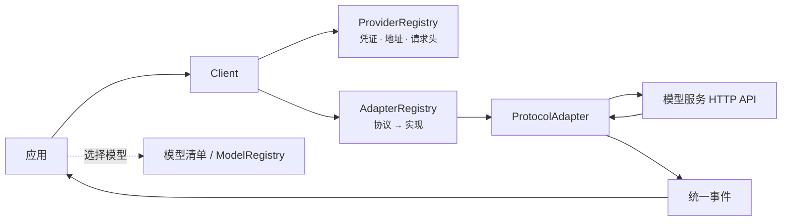
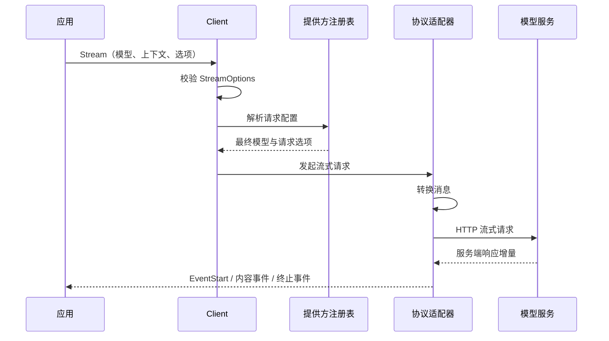

# or/llm 开发者指南

本页说明 `or/llm` 的模块关系、初始化方式、请求调用链、状态边界和扩展路径。它适合需要接入多个模型服务、配置独立 `Client`、排查请求过程或实现协议适配器的开发者。

如果只需要完成一个具体任务，直接从[使用指南](recipes/README.md)选择场景。公开符号查找见 [API 索引](api-reference.md)，字段和行为契约见“API 与概念”下的对应页面。

## 架构定位

不同模型服务对消息、工具、推理选项、流式响应、用量和错误的表达并不一致。`llm` 使用自己的 `Context`、`Message`、`Model`、`Event`、`ToolDefinition` 和 `AssistantMessage` 表达应用输入与结果，再由协议适配器完成请求构造和响应转换。

这层抽象的边界是一次模型调用：

- 调用前解析模型、凭证、服务地址和请求选项；
- 发送前按目标模型转换历史；
- 运行时将服务端增量转换为统一事件；
- 完成后返回内容、停止原因、用量、成本估算和诊断。

会话数据库、上下文压缩、工具执行、智能体运行循环、检索增强生成和模型服务调度不在这一层实现。

## 主要模块

| 模块 | 主要源码 | 负责内容 |
|---|---|---|
| 消息与模型 | `llm/message.go`、`llm/model.go` | 消息、内容块、模型能力、用量和停止原因 |
| 请求入口 | `llm/default.go`、`llm/client.go` | 校验选项、解析提供方配置、选择协议适配器 |
| 协议适配器注册 | `llm/adapters.go` | 建立 `Protocol` 到 `ProtocolAdapter` 的映射 |
| 提供方配置 | `llm/provider.go`、`llm/provider_registry.go` | 凭证、服务地址、请求头、覆盖配置和鉴权状态 |
| 模型清单 | `llm/catalog.go`、`llm/model_registry.go` | 内置清单和应用级模型注册表 |
| 历史转换 | `llm/transform.go` | 图片降级、推理内容处理和工具调用修复 |
| 流式事件 | `llm/events.go`、`llm/stream.go` | 统一事件、部分消息和终止保证 |
| 工具 | `llm/tools.go`、`llm/validation.go`、`llm/jsonschema.go` | JSON Schema 生成、参数恢复、校验和解码 |
| 内置协议适配器 | `llm/openai/`、`llm/anthropic/` | 已实现请求与响应格式的转换 |

模块之间的关系如下：



`ModelRegistry` 用于查找模型，不参与 `Client` 的请求分派。真正参与请求的是 `Model` 值、`ProviderRegistry` 和 `AdapterRegistry`。三类注册表的详细区别见[Client 与注册表](clients-and-registries.md)。

## 选择包级函数还是独立 `Client`

多数应用使用包级 `Complete` 和 `Stream`。导入协议包后，其 `init` 函数会把协议适配器注册到默认 `AdapterRegistry`；默认 `ProviderRegistry` 从内置配置创建。

```go
import (
	"github.com/ktsoator/or/llm"
	_ "github.com/ktsoator/or/llm/openai"
)
```

以下情况使用独立 `Client`：

- 不同租户或子系统需要独立的提供方覆盖配置；
- 需要自定义代理、TLS、连接池或 HTTP 传输配置；
- 测试不能修改进程共享的默认注册表；
- 只允许使用指定协议；
- 需要注册自定义 `ProtocolAdapter`。

完整构造程序见[创建自定义 Client](recipes/custom-client.md)。`Client` 本身不保存对话，也不为每次请求创建模型清单。

## 请求如何执行

一次 `Stream` 调用依次经过 `Client`、`ProviderRegistry` 和 `ProtocolAdapter`：



`Complete` 复用同一条流式路径，在内部持续读取事件，并在 `EventDone` 或 `EventError` 后返回 `AssistantMessage`。因此两种入口共享消息转换、错误映射、用量和诊断逻辑。

事件通道无缓冲。使用 `Stream` 时必须持续读取到关闭，即使请求上下文已取消或应用不再展示增量。事件顺序和终止规则见[流式事件](streaming.md)。

## 配置在哪一层生效

| 配置范围 | 类型 | 适合放置的值 |
|---|---|---|
| 单次请求 | `StreamOptions` | 用户凭证、采样参数、输出上限、超时、请求头和回调 |
| 单个提供方 | `ProviderOverride` | 网关地址、共享凭证、公共请求头和环境覆盖 |
| 单个 `Client` | `AdapterRegistry`、`ProviderRegistry` | 租户隔离、协议允许列表和测试状态 |
| 单个模型 | `Model`、`ModelCompatibility` | 服务地址、能力、上下文限制和接口差异 |

请求值与提供方覆盖配置的优先级只在[请求选项](configuration.md)维护。需要检查协议适配器最终收到的值时，可以调用 `ProviderRegistry.ResolveRequest`，不要在业务代码中复制合并逻辑。

`OnRequest`、`RewriteRequest` 和 `OnResponse` 会对底层 SDK 的每次请求尝试执行。回调与请求在同一执行路径上，阻塞回调会直接增加延迟。观察和改写的完整示例见[记录和修改请求](recipes/observability.md)。

## 状态、并发与资源

- `Client` 不保存会话状态。应用维护 `Context.Messages` 并决定何时持久化。
- 注册表支持并发读取和修改；默认提供方注册表是进程共享状态。
- 已经通过 `ResolveRequest` 得到配置的在途请求，不受后续覆盖配置修改影响。
- `Client` 和注册表没有 `Close` 方法。
- 协议适配器负责关闭单次请求的响应流；应用负责创建并持有传入的 `http.Client` 及其底层传输组件。
- 应复用 `http.Client` 及其底层传输组件，避免每次请求重新创建连接池。
- 请求上下文控制整个调用；`StreamOptions.Timeout` 控制单次 HTTP 尝试。

对话的并发更新、存储版本和恢复过程见[保存与恢复对话](recipes/conversation-persistence.md)。

## 扩展路径

先判断目标服务改变的是配置还是请求与响应格式：

| 目标 | 推荐扩展点 |
|---|---|
| 更换已有提供方的服务地址或凭证 | `ProviderOverride` |
| 接入一个兼容现有协议的服务 | 直接构造 `Model` |
| 注册新的提供方、凭证变量和模型集合 | `NewSpecProvider`、`ProviderRegistry.Register` |
| 修改代理、TLS、连接池或 HTTP 传输配置 | 为内置协议适配器注入 `*http.Client` |
| 观察请求或补充暂未类型化的字段 | `OnRequest`、`RewriteRequest`、`OnResponse` |
| 支持新的请求与响应格式 | 实现 `ProtocolAdapter` 和必要的 `ProtocolStreamOptions` |

`StreamWriter` 帮助自定义协议适配器遵循统一的事件生命周期。完整实现要求见[自定义协议](extending.md)。消息与内容块接口含未导出的标记方法，外部包不能自行增加新角色或内容块。

## 上线前检查

- 使用 `LookupModel` 处理配置或用户提供的模型 ID，避免未知值触发 panic。
- 使用 `GetRunnableModels` 或 `SupportsProtocol` 确认当前程序已经注册目标协议。
- 使用 `AuthStatus` 检查是否能解析凭证，但仍需真实请求验证凭证权限。
- 为整个调用设置请求上下文截止时间，并明确底层 SDK 重试与应用重试的边界。
- 流式事件必须读取到通道关闭；调用端断开连接时，先取消请求上下文，再继续读取并丢弃剩余事件，直至通道关闭。
- 工具执行设置授权、超时、幂等键、并发数和循环上限。
- 对提示词、图片、工具参数、请求体、历史和推理签名执行脱敏与访问控制。
- 分别记录原始 `Usage` 和成本估算；`Usage.Cost` 不等于模型服务账单。
- 使用目标模型服务验证鉴权、流式、工具、推理、用量和错误路径。

框架没有内置日志文件、指标导出器、账单对账或官方吞吐量基准数据。

## 排查入口

| 现象 | 从这里开始 |
|---|---|
| 请求开始前直接返回 `error` | [失败信号](errors.md) |
| 流不结束、取消后仍阻塞 | [问题排查](troubleshooting.md#取消后流一直不关闭) |
| 模型存在但不能调用 | [查找模型与检查凭证](recipes/provider-discovery.md) |
| 输出截断或上下文超限 | [处理请求失败](recipes/error-handling.md) |
| 工具参数不完整或校验失败 | [工具定义与调用](tools.md#执行前校验) |
| 自定义服务请求不兼容 | [接入自定义模型服务](recipes/custom-gateway.md) |

源码约束和协议适配器的实现细节见[源码解析](../internals/overview.md)。
