# or/llm

`or/llm` 是 `github.com/ktsoator/or` 中面向 Go 开发者的 LLM 协议层。它为 OpenAI Chat Completions 兼容 endpoint 和 Anthropic Messages 兼容 endpoint 提供统一的消息、模型、工具、推理与流式事件接口。适用场景包括聊天后端、流式 UI、结构化工具调用、多模型路由和自定义模型网关。

## 1. 框架概述

### 解决的问题

不同 LLM provider 在请求字段、消息格式、推理内容、工具调用、流式事件、usage 和错误表示上存在差异。`llm` 将这些差异收敛到一套 Go 类型，并在每次请求时完成双向转换。

主要目标：

- 使用同一个 `Context` 调用两种已实现协议；
- 在模型切换时重新适配已存历史；
- 将文本、推理和工具调用统一为类型化流式事件；
- 让工具定义、参数验证和结果回传不依赖 provider；
- 保留 provider 必需的 reasoning 和 tool-call 签名；
- 将模型能力、上下文限制和目录价格暴露给调用方。

### 与普通 SDK 包装的区别

`llm` 不只是把两个 SDK 放在同一 client 下。它定义了 provider-neutral 的 `Message`、`Context`、`Model`、`Event` 和 `ToolDefinition`，并在 adapter 中执行：

- 历史转换；
- compatibility 方言处理；
- SSE/SDK 事件归一化；
- tool-call 参数恢复；
- usage 和成本归一化；
- stop reason 映射。

### 适用场景

- 应用自行管理消息历史和工具执行；
- 同一业务需要调用多个兼容 provider；
- UI 需要分别展示文本、thinking 和工具进度；
- 需要自定义 endpoint、代理、headers 或 HTTP Transport；
- 需要在不引入完整 Agent 运行时的情况下使用工具调用。

### 不适用场景

- 希望框架自动保存会话、裁剪上下文或运行工具循环；
- 需要 RAG、向量检索、任务调度或 Agent 规划；
- endpoint 只提供当前未实现的 OpenAI Responses、Google Generative AI 或 Mistral Conversations 协议；
- 需要音频、文档或自定义消息块。消息内容接口是封闭的。

## 2. 整体架构

### 核心模块

| 模块 | 文件 | 职责 |
|---|---|---|
| 领域模型 | `llm/message.go`、`llm/model.go` | 消息、内容块、模型、usage、停止原因 |
| 请求入口 | `llm/default.go`、`llm/client.go` | 参数校验、provider 解析、adapter 分派 |
| Adapter 注册 | `llm/adapters.go` | `Protocol` 到 `ProtocolAdapter` 的并发安全映射 |
| Provider 配置 | `llm/provider.go`、`llm/provider_registry.go` | key、URL、headers、override 和认证状态 |
| 模型目录 | `llm/catalog.go`、`llm/model_registry.go` | 嵌入目录和模型查询 |
| 历史转换 | `llm/transform.go` | 图像降级、reasoning 清理、tool-call 修复 |
| 流式运行 | `llm/events.go`、`llm/stream.go` | 统一事件和单一终止事件 |
| 工具 | `llm/tools.go`、`llm/validation.go`、`llm/jsonschema.go` | Schema 生成、参数恢复、校验与解码 |
| OpenAI adapter | `llm/openai/` | Chat Completions 请求和 SSE 响应转换 |
| Anthropic adapter | `llm/anthropic/` | Messages 请求和 block stream 转换 |

### 模块协作

```mermaid
flowchart LR
    app["Application"] --> entry["Complete / Stream"]
    entry --> validate["StreamOptions.Validate"]
    validate --> providers["ProviderRegistry.ResolveRequest"]
    providers --> registry["AdapterRegistry.Get(Model.Protocol)"]
    registry --> adapter["ProtocolAdapter.Stream"]
    adapter --> transform["TransformMessages"]
    transform --> sdk["Provider SDK / HTTP / SSE"]
    sdk --> writer["StreamWriter"]
    writer --> events["Event stream"]
    events --> app
```



### 启动过程

1. `llm/default.go` 创建默认 adapter registry、provider registry 和 client。
2. 应用空导入 `llm/openai`、`llm/anthropic` 或 `llm/all`。
3. adapter 子包的 `init` 调用 `llm.Register`。
4. 应用从目录获取或手动构造 `Model`。
5. `Complete` 或 `Stream` 根据 `Model.Protocol` 找到 adapter。

没有显式服务器启动、插件扫描或后台调度器。

### 单次请求数据流

1. `Client.Stream` 调用 `StreamOptions.Validate`。
2. `ProviderRegistry.ResolveRequest` 应用凭证、URL 和 header 优先级。
3. `AdapterRegistry.Get` 选择协议 adapter。
4. adapter 调用 `TransformMessages`。
5. adapter 构造 SDK client 和协议请求。
6. SDK 发起流式 HTTP 请求。
7. adapter 把 provider chunk 合并进 `AssistantMessage`。
8. `StreamWriter` 发出 start/delta/end 和一个终止事件。
9. `Complete` 消费该事件流，直到 `EventDone` 或 `EventError`。

## 3. 核心功能

### 3.1 非流式模型调用

**功能说明**

`Complete` 发送一次请求并收集完整流，返回最终 `AssistantMessage`。

**适用场景**

- HTTP 后端只需要最终文本；
- 批处理任务；
- 工具循环中的单轮调用。

**工作机制**

`Client.Complete` 先调用 `Client.Stream`，再读取事件通道。收到 `EventDone` 时返回消息；收到 `EventError` 时返回事件携带的部分消息和 error。

**主要接口**

```go
func Complete(
	ctx context.Context,
	model Model,
	input Context,
	options StreamOptions,
) (AssistantMessage, error)
```

**使用示例**

```go
package main

import (
	"context"
	"fmt"
	"log"

	"github.com/ktsoator/or/llm"
	_ "github.com/ktsoator/or/llm/openai"
)

func main() {
	model, ok := llm.LookupModel("deepseek", "deepseek-v4-flash")
	if !ok {
		log.Fatal("model not found")
	}

	response, err := llm.Complete(context.Background(), model,
		llm.Prompt("Reply with one sentence."), llm.StreamOptions{})
	if err != nil {
		log.Fatal(err)
	}
	fmt.Println(response.Text())
}
```

**限制与注意事项**

- 必须注册 `model.Protocol` 对应的 adapter。
- API key 必须能从 `StreamOptions`、provider override 或环境中解析。
- `Complete` 仍使用流式 provider API，不表示底层发送非流式请求。
- error 非 nil 时，返回消息可能包含部分内容和 usage。

### 3.2 流式响应

**功能说明**

`Stream` 返回 `<-chan Event`，把文本、thinking 和工具参数按块交给调用方。

**适用场景**

- 聊天 UI；
- 首 token 延迟敏感的接口；
- 需要展示推理或工具调用进度。

**工作机制**

adapter 在 goroutine 中读取 SDK stream。`StreamWriter` 发出 `EventStart`，随后为每个内容块发出 start、delta、end，最后发出唯一的 `EventDone` 或 `EventError`。

**主要接口**

```go
func Stream(
	ctx context.Context,
	model Model,
	input Context,
	options StreamOptions,
) (<-chan Event, error)
```

**使用示例**

```go
events, err := llm.Stream(ctx, model, llm.Prompt("Write a haiku."), llm.StreamOptions{})
if err != nil {
	log.Fatal(err)
}

for event := range events {
	switch event.Type {
	case llm.EventTextDelta:
		fmt.Print(event.Delta)
	case llm.EventDone:
		fmt.Printf("\ntokens=%d\n", event.Message.Usage.TotalTokens)
	case llm.EventError:
		log.Printf("stream failed: %v", event.Err)
	}
}
```

**限制与注意事项**

- 事件通道是无缓冲通道。必须持续消费到关闭。
- 如果业务不再处理增量，启动 drain 逻辑后再取消 context。
- 只在 `EventDone` 后执行工具调用。
- `Partial` 是当前消息快照；高频读取会增加分配和处理成本。
- context 取消会被报告为 `StopReasonAborted`，前提是 adapter goroutine 能继续发送终止事件。

### 3.3 对话、持久化与模型切换

**功能说明**

`Context.Messages` 保存 provider-neutral 历史。调用方追加 assistant 消息和后续用户消息，并在下一轮重新发送。

**适用场景**

- 多轮聊天；
- 将会话保存到数据库；
- 在轮次间切换模型或协议。

**工作机制**

`TransformMessages` 在每次请求前：

- 为纯文本模型替换图像；
- 只对同一 provider、protocol 和 model 回放 reasoning 签名；
- 跨模型删除 reasoning 和 thought signature；
- 规范化 tool-call ID 并同步结果；
- 删除失败或取消产生的不完整 assistant turn；
- 为未回答工具调用补充错误结果。

**主要接口**

- `Context`、`Message`；
- `UserText`、`AssistantText`、`ToolResult`；
- `MarshalMessage`、`UnmarshalMessage`；
- `TransformMessages`。

**使用示例**

```go
messages := []llm.Message{llm.UserText("Name a Go router.")}

reply, err := llm.Complete(ctx, model,
	llm.Context{Messages: messages}, llm.StreamOptions{})
if err != nil {
	log.Fatal(err)
}

messages = append(messages, &reply)
messages = append(messages, llm.UserText("Show a minimal route."))

reply, err = llm.Complete(ctx, anotherModel,
	llm.Context{Messages: messages}, llm.StreamOptions{})
```

**限制与注意事项**

- 历史由调用方保存；库没有会话存储。
- system prompt 位于 `Context.SystemPrompt`，不会自动写进消息历史。
- 序列化历史可能包含用户数据、工具结果和 provider 签名，应按敏感数据处理。
- tool result 必须位于对应 assistant tool call 之后。

### 3.4 图像输入

**功能说明**

`ImageContent` 在用户消息或工具结果中携带 base64 图像。

**适用场景**

- 截图分析；
- 图像问答；
- 工具把生成图像返回给模型。

**工作机制**

adapter 将 `ImageContent` 转成目标协议的图像块。`Model.Input` 不包含 `Image` 时，`TransformMessages` 将连续图像替换为文本占位符。

**主要接口**

- `UserImage(data, mimeType)`；
- `ImageContent{Data, MIMEType}`；
- `Model.Input`、`ModelInput`、`Image`。

**使用示例**

```go
raw, err := os.ReadFile("screenshot.png")
if err != nil {
	log.Fatal(err)
}

input := llm.Context{Messages: []llm.Message{
	&llm.UserMessage{Content: []llm.UserContent{
		&llm.TextContent{Text: "Describe this screenshot."},
		&llm.ImageContent{
			Data:     base64.StdEncoding.EncodeToString(raw),
			MIMEType: "image/png",
		},
	}},
}}
```

**限制与注意事项**

- 当前只建模 base64 数据，没有 URL 图像类型。
- assistant 消息不能包含 `ImageContent`。
- MIME type 和 data 为空时 adapter 返回错误。
- 文本模型只收到占位符，不会看到图像内容。

### 3.5 推理内容

**功能说明**

`StreamOptions.Reasoning` 使用中立等级请求 provider reasoning。返回的 thinking 与答案文本使用不同内容块和事件。

**适用场景**

- 为复杂任务选择推理强度；
- 在 UI 中分开渲染思考和答案；
- 保留多轮工具调用所需签名。

**工作机制**

adapter 调用 `ClampThinkingLevel`，再映射到 provider 字段。Anthropic 可选择 summarized 或 omitted display。跨模型回放时 reasoning 被删除。

**主要接口**

- `ModelThinkingLevel`；
- `SupportedThinkingLevels`、`ClampThinkingLevel`；
- `ThinkingContent`；
- `EventThinkingStart/Delta/End`；
- `AnthropicStreamOptions.ThinkingDisplay`。

**使用示例**

```go
options := llm.StreamOptions{Reasoning: llm.ModelThinkingHigh}
events, err := llm.Stream(ctx, model, input, options)
if err != nil {
	log.Fatal(err)
}
for event := range events {
	if event.Type == llm.EventThinkingDelta {
		fmt.Fprint(reasoningWriter, event.Delta)
	}
}
```

**限制与注意事项**

- 非 reasoning 模型忽略该选项。
- thinking token 计入输出 usage。
- `ThinkingDisplayOmitted` 不关闭推理，只隐藏返回文本。
- reasoning 和签名只应回放给原模型；内置转换自动处理。

### 3.6 工具调用

**功能说明**

工具 API 从 Go 结构体生成 JSON Schema，把模型调用校验并解码回该结构体。工具执行仍由应用负责。

**适用场景**

- 查询业务数据；
- 调用外部 API；
- 让模型生成受 Schema 约束的操作参数。

**工作机制**

1. `NewTool` 或 `MustTool` 生成 `ToolDefinition`。
2. 工具放入 `Context.Tools`。
3. 模型返回 `ToolCall`。
4. `DecodeToolCall` 执行强制转换、Schema 校验和 Go 解码。
5. 应用执行工具并追加 `ToolResultMessage`。
6. 再次调用模型。

**主要接口**

- `NewTool[T]`、`MustTool[T]`；
- `DecodeToolCall[T]`；
- `ValidateToolCall`、`ValidateToolArguments`；
- `ToolResult`；
- `OpenAICompletionsStreamOptions`、`AnthropicStreamOptions`。

**使用示例**

```go
type WeatherArgs struct {
	City string `json:"city" jsonschema:"minLength=1"`
}

tool := llm.MustTool[WeatherArgs]("get_weather", "Get current weather")
messages := []llm.Message{llm.UserText("Weather in Paris?")}

response, err := llm.Complete(ctx, model, llm.Context{
	Messages: messages,
	Tools:    []llm.ToolDefinition{tool},
}, llm.StreamOptions{})
if err != nil {
	log.Fatal(err)
}

messages = append(messages, &response)
for _, call := range response.ToolCalls() {
	args, err := llm.DecodeToolCall[WeatherArgs](tool, call)
	result := llm.ToolResult(call.ID, call.Name, "sunny in "+args.City)
	if err != nil {
		result = llm.ToolResult(call.ID, call.Name, err.Error())
		result.IsError = true
	}
	messages = append(messages, result)
}
```

**限制与注意事项**

- 在 `EventDone` 前不要执行流式出现的 tool call。
- 每个 tool call 必须有一个结果。
- 参数可能从不完整 JSON 中恢复；有副作用前检查 `Diagnostics`。
- Schema 校验器覆盖工具常用子集，不是完整 JSON Schema 实现。
- 工具循环必须设置轮数上限。

### 3.7 模型与 Provider 管理

**功能说明**

模型目录用于发现模型；provider 注册表用于解析凭证和应用请求覆盖。

**适用场景**

- 模型选择 UI；
- 检查 provider 是否配置；
- 将 provider 流量转向代理；
- 注册本地或私有 endpoint。

**工作机制**

`ModelRegistry` 按 provider 和 ID 保存模型。`ProviderRegistry` 按 provider 保存凭证来源和 override。`Client` 只需要一个具体 `Model`，不会自动查询应用级 `ModelRegistry`。

**主要接口**

- `LookupModel`、`GetRunnableModels`、`SupportsProtocol`；
- `DefaultProviderRegistry`、`AuthStatus`；
- `SetOverride`、`ClearOverride`；
- `NewSpecProvider`；
- `NewModelRegistry`、`NewProviderRegistry`。

**使用示例**

```go
registry := llm.DefaultProviderRegistry()
status, ok := registry.AuthStatus("deepseek", nil)
if ok && !status.Configured {
	log.Fatalf("missing one of %v", status.Missing)
}

proxy := "https://gateway.example.com/deepseek/v1"
registry.SetOverride("deepseek", llm.ProviderOverride{BaseURL: &proxy})
defer registry.ClearOverride("deepseek")
```

**限制与注意事项**

- `GetModels` 包含没有 adapter 的目录模型。
- 使用 `GetRunnableModels` 构建可调用列表。
- 官方 OpenAI 目录模型当前使用未实现的 `openai-responses`。
- override 是进程内共享配置；多租户 URL 应使用独立 client。

### 3.8 可观测性与请求改写

**功能说明**

`StreamOptions` 提供每次 HTTP 尝试的请求、响应回调，以及发送前 JSON 改写。

**适用场景**

- tracing 和审计；
- 观察 SDK 重试；
- 临时补充类型化 API 尚未暴露的 provider 字段。

**工作机制**

adapter 构建 SDK client 时安装 middleware。SDK 每次重试会重新运行 middleware。`OnRequest` 观察序列化正文，随后 `RewriteRequest` 可替换正文，`OnResponse` 在响应正文被消费前执行。

**主要接口**

- `StreamOptions.OnRequest`；
- `StreamOptions.RewriteRequest`；
- `StreamOptions.OnResponse`；
- `StreamOptions.MaxRetries`、`Timeout`。

**使用示例**

```go
options := llm.StreamOptions{
	OnRequest: func(method, url string, body []byte) {
		log.Printf("%s %s bytes=%d", method, url, len(body))
	},
	OnResponse: func(status int, headers http.Header) {
		log.Printf("status=%d request-id=%s", status, headers.Get("X-Request-ID"))
	},
}
```

**限制与注意事项**

- 回调可接触用户提示、工具参数和响应 metadata，日志前应脱敏。
- `RewriteRequest` 可以生成无效 JSON；adapter 不会再次进行类型校验。
- 回调在 provider stream goroutine 内执行，阻塞回调会增加请求延迟。
- 当前材料没有定义内置 metrics exporter 或日志后端。

## 4. 配置说明

### StreamOptions

| 配置项 | 类型 | 默认值 | 是否必填 | 作用 | 注意事项 |
|---|---|---|---|---|---|
| `APIKey` | `string` | `""` | 否 | 单请求凭证 | 空时继续查 override 和环境 |
| `Env` | `ProviderEnv` | nil | 否 | 请求级环境覆盖 | 不修改进程环境 |
| `Temperature` | `*float64` | nil | 否 | 覆盖采样温度 | Anthropic thinking 激活时可能被忽略 |
| `MaxTokens` | `int64` | 0 | 否 | 输出上限 | Anthropic 为 0 时使用 `Model.MaxTokens`；两者都为 0 时失败 |
| `Headers` | `map[string]string` | nil | 否 | 请求 headers | 覆盖模型/provider 同名值 |
| `Reasoning` | `ModelThinkingLevel` | `""` | 否 | 推理等级 | 自动贴合模型能力 |
| `ProtocolOptions` | `ProtocolStreamOptions` | nil | 否 | 协议特定设置 | 类型必须与 `Model.Protocol` 匹配 |
| `MaxRetries` | `*int` | nil | 否 | SDK 重试次数 | `0` 禁用 SDK 重试 |
| `Timeout` | `time.Duration` | 0 | 否 | 每次 HTTP 尝试超时 | context 仍控制整个请求 |
| `OnRequest` | callback | nil | 否 | 观察每次请求 | 可能包含敏感正文 |
| `RewriteRequest` | callback | nil | 否 | 替换请求 JSON | 返回 nil 表示不修改 |
| `OnResponse` | callback | nil | 否 | 观察状态和 headers | 每次重试响应都会触发 |

### ProviderOverride

| 配置项 | 类型 | 默认值 | 是否必填 | 作用 | 注意事项 |
|---|---|---|---|---|---|
| `BaseURL` | `*string` | nil | 否 | 替换 provider 全部模型 URL | 影响使用该 registry 的后续请求 |
| `APIKey` | `*string` | nil | 否 | provider 级凭证 | 请求级 `APIKey` 优先 |
| `Headers` | `map[string]string` | nil | 否 | provider headers | 请求级 headers 优先 |
| `Env` | `ProviderEnv` | nil | 否 | provider 环境覆盖 | 请求级 `Env` 优先 |

### 凭证优先级

从高到低：

1. `StreamOptions.APIKey`；
2. `ProviderOverride.APIKey`；
3. `StreamOptions.Env`；
4. `ProviderOverride.Env`；
5. 进程环境。

## 5. 快速开始

### 1. 安装

项目要求 Go 1.24 或更高版本。

```sh
go get github.com/ktsoator/or/llm@latest
```

### 2. 配置凭证

```sh
export DEEPSEEK_API_KEY=your-key
```

### 3. 创建程序

```go
package main

import (
	"context"
	"fmt"
	"log"

	"github.com/ktsoator/or/llm"
	_ "github.com/ktsoator/or/llm/openai"
)

func main() {
	model, ok := llm.LookupModel("deepseek", "deepseek-v4-flash")
	if !ok || !llm.SupportsProtocol(model.Protocol) {
		log.Fatal("model is not runnable")
	}

	response, err := llm.Complete(context.Background(), model,
		llm.PromptWithSystem("Be concise.", "What is a goroutine?"),
		llm.StreamOptions{MaxTokens: 256})
	if err != nil {
		log.Fatal(err)
	}

	fmt.Println(response.Text())
	fmt.Printf("tokens=%d cost=$%.6f\n",
		response.Usage.TotalTokens, response.Usage.Cost.Total)
}
```

### 4. 运行

```sh
go run .
```

运行结果包含 provider 生成的文本。实际内容不是固定值。

## 6. 生命周期与执行流程

### 初始化

- Go 加载 `llm`，创建默认注册表和 client。
- 空导入执行 adapter 的 `init` 注册。
- 模型目录 JSON 在包初始化时解码到内置 `ModelRegistry`。
- provider 注册表从目录和 `llm/keys.go` 构造。

### 请求执行

```text
Validate options
  → resolve provider configuration
  → select adapter
  → transform history
  → build SDK client and request
  → start HTTP stream
  → decode provider events
  → emit normalized events
  → done or error
```

### Middleware 顺序

adapter 将 middleware 交给 provider SDK。当前实现按构造顺序加入：基础 client 选项、SSE 兼容处理（OpenAI）、`OnRequest`、`RewriteRequest`、`OnResponse`、headers。SDK 的最终 middleware 嵌套顺序由所使用 SDK 决定；当前材料没有定义比回调行为更严格的跨 SDK 顺序保证。

每次重试重新执行请求与响应回调。`RewriteRequest` 每次从原始序列化正文开始，不会重复叠加上一次改写结果。

### 终止与资源释放

- adapter goroutine 持有 SDK stream，并在退出时调用 `stream.Close()`。
- goroutine 在发送一个终止事件后关闭事件通道。
- `Client`、registry 和 adapter 没有 `Close` 方法。
- context 用于取消整个请求；`Timeout` 限制每次 HTTP 尝试。
- 调用方必须读取事件通道到关闭，避免 adapter 阻塞在发送上。

## 7. 扩展机制

### 兼容 endpoint

endpoint 实现现有线协议时，直接构造 `Model`，设置 `Protocol` 和 `BaseURL`。不要为每个兼容 provider 创建新 adapter。

### Provider

使用 `NewSpecProvider` 声明 ID、名称、环境变量、模型和 headers，再注册到 `ProviderRegistry`。`ProviderSpec` 不支持 OAuth 刷新或多字段动态认证；当前材料将此类行为列为后续扩展。

### 请求 Hook

使用 `OnRequest`、`OnResponse` 和 `RewriteRequest` 观察或改写单次请求。它们不是全局插件系统。

### 显式依赖注入

`NewClient` 接收 adapter 和 provider 注册表。`openai.NewAdapter` 和 `anthropic.NewAdapter` 接收 `*http.Client`。这是当前代码提供的依赖注入边界。

### 自定义协议

实现：

```go
type ProtocolAdapter interface {
	Protocol() Protocol
	Stream(context.Context, Model, Context, StreamOptions) (<-chan Event, error)
}
```

使用 `StreamWriter` 复用统一事件生命周期。自定义协议选项实现 `ProtocolStreamOptions`。

### 不可从外部扩展的部分

消息和内容块接口包含未导出 marker 方法。外部包不能新增消息角色或内容块。新增音频、文档、citation 等类型需要修改 `llm` 核心代码，项目当前没有公开扩展点。

## 8. 错误处理与排查

| 现象 | 可能原因 | 排查入口 | 处理方式 |
|---|---|---|---|
| `no adapter registered` | 未导入 adapter 或模型协议未实现 | `model.Protocol`、`SupportsProtocol` | 导入 `llm/openai`/`llm/anthropic`；catalog-only 协议无法修复为导入问题 |
| `GetModel` panic | provider/model ID 不在目录 | `GetProviders`、`GetModels` | 动态输入改用 `LookupModel` |
| API key 为空 | 环境变量、override 或请求 key 缺失 | `APIKeyEnvVars`、`AuthStatus` | 配置 key 或传 `StreamOptions.APIKey` |
| 请求 setup 返回 error | options 类型不匹配、工具无效、模型 ID 空 | `StreamOptions.Validate`、错误文本 | 修正本地配置；请求尚未开始 |
| 流以 `EventError` 结束 | HTTP、SDK、provider 或解析失败 | `Event.Err`、`Event.Message.ErrorMessage` | 区分临时错误和请求错误；不要执行该消息的工具调用 |
| `StopReasonLength` | 输出达到上限 | `MaxTokens`、`Usage` | 增大上限或让模型续写 |
| 上下文超限 | history 超过模型窗口 | `IsContextOverflow`、`Model.ContextWindow` | 调用方压缩、摘要或删除旧消息 |
| 工具解码失败 | 名称错误、参数缺失、Schema 不匹配 | `Diagnostics`、`DecodeToolCall` error | 返回 `IsError=true` 的工具结果让模型重试 |
| 取消后不退出 | 消费者停止读取无缓冲事件通道 | goroutine dump、stream 消费代码 | 持续 drain 通道；修复调用方生命周期 |
| usage 或成本为零 | provider 未返回 usage 或目录价格为空 | `OnResponse`、模型元数据 | 将成本视为估算；当前材料没有 provider 账单对账功能 |

日志由应用负责。`llm` 没有内置日志文件或全局 logger。使用 hooks 接入现有日志/trace 系统，写入前对正文和 headers 脱敏。

## 9. 使用限制

### 协议

- 已实现：`openai-completions`、`anthropic-messages`。
- 仅目录：`openai-responses`、`google-generative-ai`、`mistral-conversations`。
- 官方 OpenAI 目录模型当前不可通过内置 adapter 运行。

### 并发

- 三类 registry 使用锁保护，可并发访问。
- 默认 provider registry 是进程共享状态。
- 单个 stream 由一个 adapter goroutine 生产事件。
- 无缓冲通道提供反压，但消费者停止读取会阻塞生产者。

### 性能

- 每个非终止事件构造 `Partial` 快照。
- 文本和 thinking 按 delta 追加；大量小 delta 会增加分配。
- base64 图像增加内存与请求体积。
- 当前材料没有提供官方吞吐量 benchmark 或容量上限。

### 安全

- API key 以字符串保存在内存配置中。
- `OnRequest`、`RewriteRequest` 和序列化历史可能接触敏感数据。
- provider reasoning 签名和 tool result 也应按敏感数据存储。
- 工具参数在执行副作用前必须校验。

### Schema

工具 Schema 生成依赖 `github.com/invopop/jsonschema`。参数校验由 `llm/jsonschema.go` 实现常用子集。当前材料没有声明对完整 JSON Schema 规范的兼容保证。

### 模型目录

目录在构建时嵌入。价格、能力和模型状态可能落后于 provider。目录成本不是正式账单。

## 10. API 或模块索引

| 模块 | 主要 API | 文档 |
|---|---|---|
| 请求 | `Complete`、`Stream`、`Client` | [API 索引](api-reference.md#请求入口) |
| 输入 | `Context`、`Prompt`、`UserText`、`UserImage` | [对话](conversations.md) |
| 结果 | `AssistantMessage`、`Usage`、`StopReason` | [读取响应](results.md) |
| 流式 | `Event`、`EventType`、`StreamWriter` | [流式响应](streaming.md) |
| 工具 | `NewTool`、`DecodeToolCall`、`ToolResult` | [工具](tools.md) |
| 推理 | `ModelThinkingLevel`、`ThinkingContent` | [推理](reasoning.md) |
| 模型 | `Model`、`LookupModel`、`ModelRegistry` | [Provider 与模型](providers.md) |
| Provider | `ProviderRegistry`、`ProviderOverride` | [Client 与注册表](clients-and-registries.md) |
| 配置 | `StreamOptions`、hooks | [请求配置](configuration.md) |
| 扩展 | `ProtocolAdapter`、`ProtocolStreamOptions` | [自定义协议](extending.md) |
| 错误 | `IsContextOverflow`、`Diagnostic` | [错误处理](errors.md) |
| 支持范围 | 协议与 provider 状态 | [支持矩阵](support-matrix.md) |

完整公开符号列表见 [API 索引](api-reference.md)。
