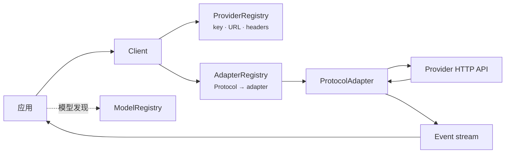
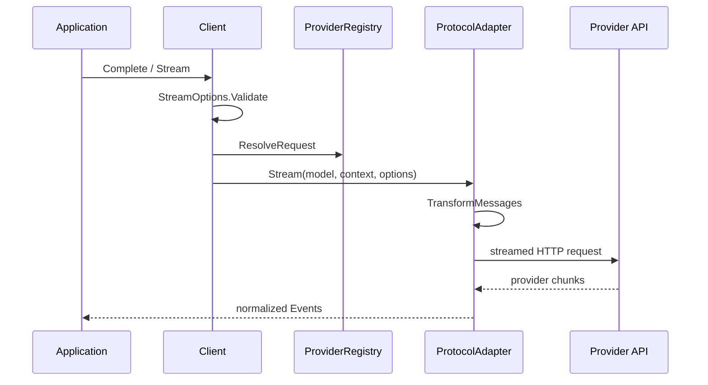

# or/llm 开发者指南

本文说明 `or/llm` 的架构、模块协作、请求生命周期、扩展边界和运行限制。具体功能的完整代码只在对应专题与[场景手册](recipes/README.md)维护；公开符号签名见 [API 索引](api-reference.md)。

## 1. 框架概述

### 解决的问题

LLM provider 对消息格式、工具、推理字段、流式事件、usage 和错误的表达不同。`llm` 用中立领域类型承载应用输入和结果，再由协议 adapter 完成线格式转换。

核心目标：

- 同一 `Context` 可以发送给已实现协议下的不同模型；
- 历史在每次请求前按目标模型重新适配；
- 文本、推理和工具调用通过统一事件生命周期返回；
- 工具定义、参数校验、usage 和停止原因不依赖 provider SDK 类型；
- 应用可以替换模型服务地址、凭证、HTTP transport 或完整协议 adapter。

### 与普通 SDK 包装的区别

`llm` 不向上暴露两个 provider SDK 的联合接口。`Message`、`Model`、`Context`、`Event`、`ToolDefinition` 和 `AssistantMessage` 是独立领域模型。Adapter 负责 provider 请求构造、历史转换、流式归一化、兼容方言和错误映射。

### 适用场景

- 应用自行管理历史和工具执行；
- 同一业务需要调用多个兼容 provider；
- UI 需要分别处理文本、thinking 和工具调用进度；
- 服务需要自定义模型 API 地址、代理、headers、TLS 或连接池；
- 需要 LLM 请求层，但不需要完整 Agent 运行时。

### 不适用场景

会话存储、上下文压缩、自动工具执行、Agent 规划、RAG、任务调度和 provider 负载均衡不属于本包。协议实现状态以[支持矩阵](support-matrix.md)为准。

## 2. 整体架构

### 核心模块

| 模块 | 主要文件 | 职责 |
|---|---|---|
| 领域模型 | `llm/message.go`、`llm/model.go` | 消息、内容块、模型、usage、停止原因 |
| 请求入口 | `llm/default.go`、`llm/client.go` | 参数校验、provider 解析和 adapter 分派 |
| Adapter 注册 | `llm/adapters.go` | `Protocol` 到 `ProtocolAdapter` 的映射 |
| Provider 配置 | `llm/provider.go`、`llm/provider_registry.go` | 凭证、URL、headers、override 和认证状态 |
| 模型目录 | `llm/catalog.go`、`llm/model_registry.go` | 嵌入目录与应用级模型注册表 |
| 历史转换 | `llm/transform.go` | 图像降级、reasoning 清理、工具调用修复 |
| 流式运行 | `llm/events.go`、`llm/stream.go` | 统一事件和终止保证 |
| 工具 | `llm/tools.go`、`llm/validation.go`、`llm/jsonschema.go` | Schema、恢复、校验和解码 |
| 内置 adapter | `llm/openai/`、`llm/anthropic/` | 两种已实现协议的请求与响应转换 |

### 注册表、Client 与 Adapter

- `AdapterRegistry` 决定某个 `Model.Protocol` 由谁处理。
- `ProviderRegistry` 解析该模型请求的凭证、URL 和 headers。
- `ModelRegistry` 只用于发现模型；`Client` 不依赖它发起请求。
- 包级 `Complete` 和 `Stream` 使用默认 `Client`。显式 `Client` 用于状态隔离和依赖注入。

### 初始化过程

1. `llm/default.go` 创建默认 adapter registry、provider registry 和 client。
2. 应用导入 `llm/openai`、`llm/anthropic` 或 `llm/all`。
3. Adapter 子包的 `init` 向默认 adapter registry 注册协议实现。
4. 模型目录在包初始化期间解码；provider registry 从内置配置构造。
5. 应用解析或构造 `Model` 后调用请求入口。

包没有服务器启动、插件扫描或后台调度器。

## 3. 核心功能

本节只划分职责。任务到接口的完整映射见[功能总览](capabilities.md)。

| 能力 | `llm` 负责 | 调用方负责 | 权威文档 |
|---|---|---|---|
| 完整生成 | 收集事件并返回 `AssistantMessage` | 处理结果和业务错误 | [快速开始](getting-started.md) |
| 流式响应 | 统一事件、部分快照和终止事件 | 持续消费通道并更新 UI | [流式响应](streaming.md) |
| 对话 | 转换 provider-neutral 历史 | 保存、加载、追加和裁剪历史 | [对话](conversations.md) |
| 图片输入 | 转换 base64 图片；为文本模型降级 | 读取文件、验证大小和 MIME | [图片输入场景](recipes/vision.md) |
| 推理 | 映射中立等级并分离 thinking 内容 | 选择等级和展示策略 | [推理与思考](reasoning.md) |
| 工具调用 | Schema、参数恢复、校验和结果消息类型 | 授权、执行、幂等和循环上限 | [工具](tools.md) |
| 模型与 Provider | 目录查询、凭证解析和请求 override | 选择模型并验证线上兼容性 | [提供方与模型](providers.md) |
| 可观测性 | 暴露请求、改写和响应 Hook | 脱敏、指标和日志后端 | [请求配置](configuration.md) |

完整应用流程集中在[场景手册](recipes/README.md)，仓库程序集中在[示例索引](examples.md)。

## 4. 配置说明

配置的唯一字段表和凭证优先级位于[请求配置](configuration.md)。以下只说明配置作用域：

| 作用域 | 类型 | 生命周期 | 典型用途 |
|---|---|---|---|
| 单次请求 | `StreamOptions` | 一次 `Complete` 或 `Stream` | key、采样、输出上限、超时、Hook |
| 单个 provider | `ProviderOverride` | 对注册表后续请求生效 | 网关 URL、共享 headers、provider key |
| 单个 Client | `AdapterRegistry`、`ProviderRegistry` | 由应用持有 | 租户或子系统隔离 |
| 单个模型 | `Model`、`Compatibility` | 随模型值传递 | 服务地址、能力和协议差异 |

请求级值与 provider override 的合并规则不要在业务层复制。需要查看 adapter 最终收到的模型和选项时，使用 `ProviderRegistry.ResolveRequest`。

## 5. 快速开始

最短可运行路径只在[快速开始](getting-started.md)维护：

1. 使用 Go 1.24 或更高版本引入 module；
2. 配置目标 provider 的凭证；
3. 导入模型协议对应的 adapter；
4. 使用 `LookupModel` 与 `SupportsProtocol` 验证模型；
5. 调用 `Complete` 并处理 error。

场景手册中的示例在此基础上增加完整结果处理和生产约束。

## 6. 生命周期与执行流程

### 单次请求

`Complete` 复用 `Stream`，读取到 `EventDone` 或 `EventError` 后返回。Adapter goroutine 在退出时关闭 SDK stream 和事件通道。事件通道的消费约束见[流式响应](streaming.md)。

### Hook 与重试

`OnRequest`、`RewriteRequest` 和 `OnResponse` 对每次 SDK attempt 执行。`RewriteRequest` 每次以原始序列化正文为输入。跨 SDK 的 middleware 嵌套顺序没有额外保证；不要依赖未公开的执行细节。

### 资源释放

- `Client` 和 registry 没有 `Close` 方法；
- adapter 负责关闭单次请求的 provider stream；
- 传入的 `http.Client` 和 Transport 由应用拥有并复用；
- context 取消整个请求，`StreamOptions.Timeout` 限制每次 HTTP attempt；
- 流消费者必须读取事件通道直到关闭。

## 7. 扩展机制

| 需求 | 扩展点 | 说明 |
|---|---|---|
| 接入兼容现有协议的新服务地址 | 手动构造 `Model` | 设置 `Protocol`、`BaseURL` 和必要 compatibility |
| 新 provider 配置 | `NewSpecProvider`、`ProviderRegistry.Register` | 声明凭证变量、headers 和模型 |
| 自定义代理、TLS 或 Transport | `openai.NewAdapter`、`anthropic.NewAdapter` | 注入应用拥有的 `*http.Client` |
| 请求观察或字段补丁 | `OnRequest`、`RewriteRequest`、`OnResponse` | Hook 在请求 goroutine 内同步执行 |
| 框架尚未支持的请求与响应协议 | `ProtocolAdapter`、`ProtocolStreamOptions` | 使用 `StreamWriter` 维持公共事件契约 |

完整实现要求见[自定义协议](extending.md)。消息与内容块接口包含未导出的 marker 方法，外部包不能增加新角色或内容块；音频、文档、citation 等类型需要修改核心包。

## 8. 错误处理与排查

| 阶段 | 信号 | 入口 |
|---|---|---|
| 请求创建前 | `Complete`/`Stream` 直接返回 error | options、凭证、adapter 注册 |
| 流运行期间 | `EventError`；`Complete` 返回部分消息和 error | HTTP、provider、解码、取消 |
| 正常终止但需业务处理 | `AssistantMessage.StopReason` | token 上限、工具请求等 |
| 已恢复的非致命问题 | `AssistantMessage.Diagnostics` | 工具参数恢复等 |

错误语义见[错误处理](errors.md)，按症状的修复步骤见[排障](troubleshooting.md)，可复用业务策略见[错误处理场景](recipes/error-handling.md)。包没有内置日志文件或全局 logger。

## 9. 使用限制

- 已实现协议、仅目录协议和 provider 状态以[支持矩阵](support-matrix.md)为唯一来源。
- 三类 registry 可并发访问；默认 provider registry 是进程共享状态。
- 事件通道无缓冲，停止读取会阻塞 producer。
- 每个非终止事件包含 `Partial` 快照；高频处理会增加分配。
- base64 图片增加内存和请求体积。
- 工具校验覆盖常用 JSON Schema 子集，不承诺完整规范兼容。
- 模型目录在构建时嵌入；价格、能力和状态可能晚于 provider。
- Hook、序列化历史、工具结果和 reasoning 签名可能包含敏感数据。
- 当前材料没有官方吞吐量 benchmark、内置指标 exporter 或账单对账机制。

## 10. API 或模块索引

公开接口按请求、消息、事件、配置、工具、模型、provider、诊断和扩展整理在 [API 索引](api-reference.md)。专题入口如下：

| 模块 | 文档 |
|---|---|
| 请求与配置 | [快速开始](getting-started.md)、[请求配置](configuration.md) |
| 消息与结果 | [对话](conversations.md)、[读取响应](results.md) |
| 流式 | [流式响应](streaming.md) |
| 工具与推理 | [工具](tools.md)、[推理与思考](reasoning.md) |
| 模型与 provider | [提供方与模型](providers.md)、[支持矩阵](support-matrix.md) |
| Client 与注册表 | [Client 与注册表](clients-and-registries.md) |
| 错误与排障 | [错误处理](errors.md)、[排障](troubleshooting.md) |
| 测试与扩展 | [测试](testing.md)、[自定义协议](extending.md) |

内部实现与源码不变量见[源码解析](../internals/overview.md)。
