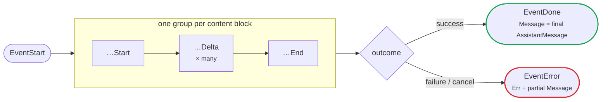

# Streaming events

This page defines the event order, field semantics, terminal conditions, and
cancellation behavior of `Stream`. For a complete UI integration and failure
policy, see [Streaming responses](recipes/streaming-chat.md).

`Stream` returns a read-only, unbuffered event channel. A background goroutine
runs the request, and the caller must receive until the channel closes. Stopping
early can block the adapter while it sends a later event. The minimal consumer
shape is:

```go
for event := range events {
	switch event.Type {
	case llm.EventThinkingDelta, llm.EventTextDelta:
		fmt.Print(event.Delta)
	case llm.EventDone:
		handleDone(event.Message)
	case llm.EventError:
		handleFailure(event.Message, event.Err)
	}
}
```

Thinking events appear only when the selected model and provider return
reasoning content. `EventError.Message` may contain partial content and usage.

## Event reference

A stream opens with `EventStart`, emits one `start → delta… → end` group per
content block (text, thinking, or tool call, possibly interleaved), and closes
with exactly one terminal event:



Every non-terminal event carries a `Partial` snapshot; the `…` prefix stands for
`Text`, `Thinking`, or `ToolCall`.

| Event | Meaning | Main fields |
|---|---|---|
| `EventStart` | The provider stream started | `Partial` |
| `EventTextStart` | A text block started | `ContentIndex`, `Partial` |
| `EventTextDelta` | A text fragment arrived | `ContentIndex`, `Delta`, `Partial` |
| `EventTextEnd` | A text block completed | `ContentIndex`, `Content`, `Partial` |
| `EventThinkingStart` | A reasoning block started | `ContentIndex`, `Partial` |
| `EventThinkingDelta` | A reasoning fragment arrived | `ContentIndex`, `Delta`, `Partial` |
| `EventThinkingEnd` | A reasoning block completed | `ContentIndex`, `Content`, `Partial` |
| `EventToolCallStart` | A tool call block started | `ContentIndex`, `ToolCall`, `Partial` |
| `EventToolCallDelta` | A raw tool-argument JSON fragment arrived | `ContentIndex`, `Delta`, `ToolCall`, `Partial` |
| `EventToolCallEnd` | A tool call finished streaming, arguments parsed best-effort | `ContentIndex`, `ToolCall`, `Partial` |
| `EventDone` | The request completed successfully | `Message` |
| `EventError` | The request failed or was cancelled | `Err`, `Message` |

`EventDone.Message` is the final assistant message and contains content, usage,
cost, and stop reason. `EventError.Message` may contain partial content and
usage. The channel emits exactly one terminal event and then closes. See
[Responses and usage](results.md) for how to interpret the final message: stop
reasons, token usage and cost, diagnostics, and context-overflow detection.

Events from different content blocks may be interleaved. Use `ContentIndex` to
associate deltas with their block. Every non-terminal event carries a `Partial`
snapshot of the assistant message built so far.

## Tool-call deltas and diagnostics

`EventToolCallDelta.Delta` contains raw partial JSON. `EventToolCallEnd` carries
the call with arguments parsed best-effort: malformed or truncated JSON degrades
to the fields received so far, or to an empty object. Validate arguments before
use, collect tool calls while streaming, and execute them only after
`EventDone`. Never execute calls from a response that ends with `EventError`.

When arguments could not be parsed strictly, the response records a
`tool_arguments_recovered` entry in `Message.Diagnostics`. Its recovery `mode`
is `repaired`, `partial`, or `invalid`. Inspect diagnostics before executing a
tool with side effects. A safe application declines `partial` and `invalid`
arguments and returns a tool error so the model can retry.

## Cancellation

Cancelling the request context asks the in-flight HTTP call to stop. The adapter
attempts to emit an `EventError` whose message reports `StopReasonAborted`, then
closes the channel. Keep receiving after cancellation. If the consumer has
already stopped, an unbuffered send can prevent the terminal event and close
from completing.

Use the independent per-attempt `Timeout` option for transport deadlines; see
[Request options](configuration.md).

`Stream` has no separate `Close` or `Abort` method. Cancel through the supplied
context; the adapter goroutine releases stream resources when it exits.
