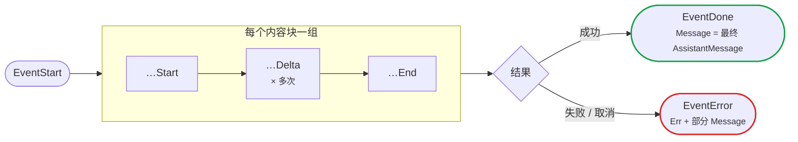

# 流式响应

使用 `Stream` 在文本和推理生成的同时进行处理。

**1. 启动流。** `Stream` 会立即返回一个通道；请求在后台运行，事件到达时随即送出。

```go
events, err := llm.Stream(
	context.Background(),
	model,
	llm.Prompt("Explain Go channels briefly."),
	llm.StreamOptions{Reasoning: llm.ModelThinkingHigh},
)
if err != nil {
	log.Fatal(err)
}
```

**2. 用类型分支消费事件。** 文本和推理增量随到随打印，在 `EventDone` 时捕获最终消息，在 `EventError` 时停止。

事件通道是无缓冲通道。循环必须继续读取到通道关闭。业务不再需要增量时，可以忽略事件内容，但仍应 drain 通道；直接停止读取会让 adapter goroutine 阻塞在下一次发送上。

```go
var finalMessage *llm.AssistantMessage
for event := range events {
	switch event.Type {
	case llm.EventThinkingDelta, llm.EventTextDelta:
		fmt.Print(event.Delta)
	case llm.EventDone:
		finalMessage = event.Message
	case llm.EventError:
		log.Fatal(event.Err)
	}
}
```

**3. 读取最终消息**——通道关闭后，从中读出停止原因、token 用量和成本。

```go
fmt.Printf("\nstop=%s tokens=%d cost=$%.6f\n",
	finalMessage.StopReason,
	finalMessage.Usage.TotalTokens,
	finalMessage.Usage.Cost.Total,
)
```

只有当所选模型和提供方暴露推理内容时，才会发出 thinking 事件。

包含超时、错误保存和 drain 处理的完整程序见[流式聊天场景](recipes/streaming-chat.md)。本页只定义公共事件契约。

## 事件参考

流以 `EventStart` 开始，每个内容块（文本、推理或工具调用，可能交错）发出一组 `start → delta… → end`，并以恰好一个终止事件结束：



每个非终止事件都带有 `Partial` 快照；`…` 前缀代表 `Text`、`Thinking` 或 `ToolCall`。

| 事件 | 含义 | 主要字段 |
|---|---|---|
| `EventStart` | 提供方流已开始 | `Partial` |
| `EventTextStart` | 文本块开始 | `ContentIndex`、`Partial` |
| `EventTextDelta` | 文本片段到达 | `ContentIndex`、`Delta`、`Partial` |
| `EventTextEnd` | 文本块完成 | `ContentIndex`、`Content`、`Partial` |
| `EventThinkingStart` | 推理块开始 | `ContentIndex`、`Partial` |
| `EventThinkingDelta` | 推理片段到达 | `ContentIndex`、`Delta`、`Partial` |
| `EventThinkingEnd` | 推理块完成 | `ContentIndex`、`Content`、`Partial` |
| `EventToolCallStart` | 工具调用块开始 | `ContentIndex`、`ToolCall`、`Partial` |
| `EventToolCallDelta` | 工具参数 JSON 原始片段到达 | `ContentIndex`、`Delta`、`ToolCall`、`Partial` |
| `EventToolCallEnd` | 工具调用流式结束，参数已尽力解析 | `ContentIndex`、`ToolCall`、`Partial` |
| `EventDone` | 请求成功完成 | `Message` |
| `EventError` | 请求失败或被取消 | `Err`、`Message` |

`EventDone.Message` 是最终的 assistant 消息，包含内容、用量、成本和停止原因。 `EventError.Message` 可能包含部分内容和用量。通道只会发出恰好一个终止事件，随后关闭。如何解读这个最终消息（停止原因、token 用量与成本、诊断，以及上下文溢出检测）参见[读取响应](results.md)。

来自不同内容块的事件可能交错出现。用 `ContentIndex` 将增量关联到对应的块。每个非终止事件都携带一份迄今为止已构建的 assistant 消息的 `Partial` 快照。

## 工具调用增量与诊断

`EventToolCallDelta.Delta` 包含原始的部分 JSON。`EventToolCallEnd` 携带的调用，其参数是尽力解析的：格式错误或被截断的 JSON 会退化为目前已收到的字段，或退化为一个空对象。请在使用前校验参数，在流式过程中收集工具调用，并只在 `EventDone` 之后执行它们。切勿执行来自以 `EventError` 结束的响应中的调用。

当参数无法被严格解析时，响应会在 `Message.Diagnostics` 中记录一条 `tool_arguments_recovered`。其恢复 `mode` 为 `repaired`、`partial` 或 `invalid`。在执行带副作用的工具前请检查诊断。稳妥的做法是拒绝 `partial` 和 `invalid` 的参数，并返回一个工具错误，让模型重试。

## 取消

取消请求 context 会请求停止进行中的 HTTP 调用。adapter 会尝试发出一个 `EventError`，其消息报告 `StopReasonAborted`，随后关闭通道。调用方在取消后仍必须继续读取通道；若消费者已经停止读取，无缓冲发送可能阻止终止事件和关闭动作完成。

```go
ctx, cancel := context.WithCancel(context.Background())
defer cancel()

events, err := llm.Stream(ctx, model, input, llm.StreamOptions{})
if err != nil {
	log.Fatal(err)
}

// 从别处调用 cancel()，例如当用户按下「停止」时。
// 取消后仍继续 range，直到通道关闭。
for event := range events {
	switch event.Type {
	case llm.EventTextDelta:
		fmt.Print(event.Delta)
	case llm.EventError:
		fmt.Printf("\nstopped: %s\n", event.Message.StopReason)
	}
}
```

传输层的截止时间请使用独立的、按尝试计的 `Timeout` 选项；参见[请求配置](configuration.md)。

`Stream` 不提供独立的 `Close` 或 `Abort` 方法。取消入口是传入的 context，资源释放由 adapter goroutine 在退出时完成。
